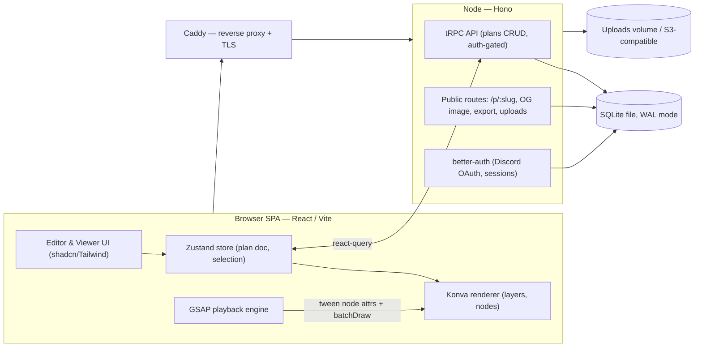

# RaidPlans — Implementation Plan

A self-hosted web app for creating and sharing animated World of Warcraft raid/arena plans, deployed at **https://raidplans.mamzer.dev**. Authors drag predefined icons onto a map "canvas", arrange them, and animate them PowerPoint‑style (appear, disappear, fade, move) across steps. Guild members view the plans (read‑only) with playback controls.

This document is written so that a professional developer **or** another AI agent can follow it end‑to‑end. It is organised as **Phases → Steps**, each phase producing something runnable, with acceptance criteria.

> **Target environment.** Production runs on **Oracle Linux 10** (RHEL‑compatible: `dnf`, `systemd`, `firewalld`, SELinux enforcing) on an **Oracle Cloud Ampere A1 ARM** VM (`aarch64`). **Development requires Linux or WSL2** (Ubuntu recommended). Mind the arch split: the Vite frontend is architecture‑independent, but native modules (`better-sqlite3`) are built per‑platform — run `pnpm install`/build **on the ARM server itself** and never copy `node_modules` from an x64 dev box to the `aarch64` host.

---

## 1. Goals & Non‑Goals

**Goals**
- Nice‑looking, fast **canvas editor**: drag & drop predefined icons onto a map, move/resize/rotate, style, label.
- **PowerPoint‑style animation**: per‑object entrance/exit/emphasis/motion effects, organised into **steps** the viewer clicks through.
- **Viewer mode** for the guild: read‑only playback, step navigation, fullscreen, shareable links.
- **Self‑hostable** on the user's own box/domain, low‑ops, with backups.
- **Performs well with 50+ objects/animations** at ~60 fps.

**Non‑Goals (initially)**
- Real‑time multi‑user co‑editing (deferred to Phase 6).
- Mobile *authoring* (viewer is mobile‑friendly; editing targets desktop).
- Deep game integrations (combat log, WeakAuras) — future.

---

## 2. Key Decisions (made for you — all reversible)

| Decision | Choice | Why | Alternative |
|---|---|---|---|
| Rendering | **Konva** (`react-konva`) over Canvas 2D | Built for interactive 2D scene graphs: drag/drop, transformers, hit‑testing, layers; comfortably handles 50–500 objects | SVG (simpler, slower at scale) · PixiJS/WebGL (overkill now, use if 1000s) |
| Animation | **GSAP** timeline | Best‑in‑class sequencing = exactly the "PowerPoint" model; tweens any property incl. Konva nodes; free incl. MotionPath | Konva.Tween (weaker sequencing) · Motion/anime.js |
| Animation UX model | **Steps + per‑object animations** | Matches "click through slides, each with entrance/exit effects" mental model; simpler than a global keyframe timeline | Global keyframe timeline (more power, more complexity) |
| App shell | **React + Vite + TypeScript (SPA)** | Your stated preference; the hard part (canvas) is client‑side either way | Next.js (SSR share pages) — noted as drop‑in if you want server‑rendered previews |
| State | **Zustand + Immer + zundo** | Minimal, fast, selective re‑renders; easy undo/redo | Redux Toolkit (heavier) |
| Backend | **Node + Hono**, **tRPC** for app API, plain routes for public/share | End‑to‑end TypeScript, tiny footprint, easy to self‑host | Fastify + REST · Next.js API routes |
| DB | **SQLite** via **Drizzle ORM** (`better-sqlite3`, WAL mode) | Light traffic → one file, no DB server, trivial backups, sub‑ms reads | Postgres — only if you later add real‑time collab or outgrow a single writer |
| Auth | **better‑auth** + **Discord OAuth** | Guilds already live on Discord; one‑click login, gate by guild | Battle.net OAuth (bonus: roster import) · email magic‑link |
| Repo | **pnpm workspace monorepo** (`apps/web`, `apps/api`, `packages/shared`) | Share the Plan schema (zod) → end‑to‑end types | Single package (fine, less type‑sharing) |
| Infra | **systemd‑managed Node process + Caddy** on Oracle Linux 10 / ARM — no Docker | Runs the API directly on the VM; Caddy gives automatic HTTPS with near‑zero config; Node/Caddy/SQLite all have first‑class `aarch64` support | Docker (declined) · nginx + certbot |

> Per your calls: **SQLite** (light traffic) and **no Docker** — the API runs as a native process behind Caddy. The two decisions still worth confirming before Phase 4 are the **auth provider** (Discord vs Battle.net vs email) and the **animation model** (steps vs full keyframe timeline). Everything else is easy to swap.

---

## 3. Recommended Tech Stack

**Frontend (`apps/web`)**
- React 18 + TypeScript + Vite
- `konva` + `react-konva` — canvas rendering
- `gsap` (+ MotionPathPlugin) — animation/playback engine
- `zustand` + `immer` + `zundo` — editor state, immutable updates, undo/redo
- `@tanstack/react-query` — server cache (pairs with tRPC)
- `react-router-dom` — routes (`/`, `/plan/:id/edit`, `/p/:slug`)
- `tailwindcss` + `shadcn/ui` (Radix) — UI components
- `zod` — validation (schemas shared from `packages/shared`)
- `@tanstack/react-virtual` — virtualize the icon palette

**Backend (`apps/api`)**
- Node 20+ / TypeScript, **Hono** HTTP server
- **tRPC** router (app API) + plain Hono routes (public share, OG image, exports, uploads)
- **Drizzle ORM** + **SQLite** (`better-sqlite3`, WAL mode) — embedded, no separate DB server
- **better-auth** (Discord OAuth), session cookies
- `satori` + `@resvg/resvg-js` — OG/preview image generation (preferred on ARM: prebuilt `aarch64` binaries, no system libs; avoid `node-canvas` unless you install its native deps)
- `pino` (logging), `zod` (validation)

**Shared (`packages/shared`)**
- The **Plan schema** (zod + inferred TS types), effect/enums, and pure helpers (state resolution). Imported by both web and api.

**Tooling / Infra**
- **Dev environment: Linux or WSL2 required** (Ubuntu recommended); Node 20/22 LTS via `nvm`/`fnm` + `corepack` for pnpm
- pnpm workspaces, ESLint, Prettier, Husky + lint‑staged
- Vitest + React Testing Library (unit/component), Playwright (E2E)
- GitHub Actions (typecheck, lint, test, build web + api artifacts)
- **No Docker:** the API runs as a native process under **systemd** on Oracle Linux 10 (`aarch64`)
- Caddy (native RPM/binary, auto‑TLS for `raidplans.mamzer.dev`) — serves the built `web` and reverse‑proxies the API
- Backups: `litestream` (continuous) → **OCI Object Storage** (S3‑compatible) or a nightly SQLite online‑backup copied off‑box

---

## 4. High‑Level Architecture



**Golden rule for performance:** React/Zustand own the document while **editing**; during **playback**, GSAP mutates Konva node properties directly and calls `layer.batchDraw()` — **no React re‑render per frame**.

---

## 5. Core Data Model

The single source of truth is a **Plan document** (JSON), validated by a shared zod schema and stored in the DB.

```ts
// packages/shared/src/plan.ts  (sketch)
type Transform = { x: number; y: number; w: number; h: number; rotation: number };

type PlanObject = {
  id: string;
  type: 'token' | 'marker' | 'shape' | 'text' | 'arrow' | 'image';
  iconId?: string;                 // ref into the icon manifest
  base: Transform & {
    opacity: number;               // 0..1
    tint?: string;                 // class color / custom
    label?: string;
    z: number;                     // stacking order
    visible: boolean;
  };
  locked?: boolean;
};

type AnimEffect = 'appear' | 'disappear' | 'fade' | 'fly' | 'move' | 'scale' | 'pulse' | 'blink';
type AnimTrigger = 'onEnter' | 'withPrevious' | 'afterPrevious' | 'onClick';

type Anim = {
  id: string;
  objectId: string;
  kind: 'entrance' | 'exit' | 'emphasis' | 'motion';
  effect: AnimEffect;
  trigger: AnimTrigger;
  delayMs: number;
  durationMs: number;
  easing: string;                  // GSAP ease name
  params?: { toX?: number; toY?: number; toOpacity?: number; path?: {x:number;y:number}[] };
};

type Step = {
  id: string;
  name?: string;
  // End-state deltas applied to objects when this step is "settled":
  overrides: Record<string /*objectId*/, Partial<Transform & { opacity: number; visible: boolean }>>;
  animations: Anim[];
  autoAdvanceMs?: number;          // optional autoplay
};

type Plan = {
  id: string;
  title: string;
  raid: string;                    // encounter/map id
  background: { assetId: string; width: number; height: number }; // native coords
  objects: PlanObject[];           // base object set (exists across steps)
  steps: Step[];                   // ordered "slides"
  schemaVersion: number;           // for migrations
};
```

**Coordinate system:** store all positions in the background's **native pixel space** (resolution‑independent). The Konva `Stage` is scaled to fit the container, so plans look identical on any screen.

**State resolution (pure function in `shared`):** given `objects` + previous step's settled state + current `step.overrides/animations`, compute the **start state** and **end state** for every object. The editor edits the end state; the viewer animates start→end. This is the "PowerPoint slide + animations" model, kept deterministic and testable.

**Persistence schema (SQLite, Drizzle):**
```
users(id, discord_id UNIQUE, name, avatar_url, created_at)
guilds(id, name, discord_guild_id)
memberships(user_id, guild_id, role /* owner|editor|viewer */, PRIMARY KEY(user_id,guild_id))
plans(id, slug UNIQUE, owner_id, guild_id, title, raid,
      visibility /* private|unlisted|public */, thumbnail_url,
      created_at, updated_at, deleted_at NULL)
plan_data(plan_id PK/FK, schema_version, doc TEXT, updated_at)   -- current document
plan_versions(id, plan_id, doc TEXT, created_at)                 -- optional history (Phase 6)
assets(id, owner_id, kind /* background|icon|upload */, url, width, height, created_at)
```
> The whole Plan lives as one **JSON text** blob (`plan_data.doc`, stored as `TEXT`; SQLite's JSON1 functions can query inside it if ever needed). It's small (tens of KB even with 50+ objects), trivial to load/save atomically, and versionable. Relational columns exist only for listing, access control, and search.

---

## 6. Canvas & Rendering Design

- **Layers (few, purposeful):** (1) background image, (2) interactive objects, (3) transformer/handles + selection UI, (4) transient overlays (alignment guides). Each Konva layer = one `<canvas>`; keep the count small.
- **Objects → nodes:** each `PlanObject` maps to a Konva node (`Image` for icons, `Rect/Circle/Arrow/Line/Text` for primitives). A React component per object via `react-konva`, keyed by id.
- **Interaction:** drag to move; `Konva.Transformer` for resize/rotate on selection; click/shift‑click multi‑select; marquee select; delete/duplicate; arrow‑key nudge; snap to grid + alignment guides.
- **Pan & zoom:** wheel zoom to cursor, space‑drag pan; clamp scale; fit‑to‑screen button. Store pan/zoom in view state (not in the plan doc).
- **Icon rendering:** preload each icon `Image` once into a cache keyed by `iconId`; reuse across all nodes. Consider a **sprite atlas** (single texture) for the palette + tokens to cut HTTP requests and memory.
- **Tokens:** composite node = icon + optional class‑color ring + name label; cache with `.cache()` so it draws as one bitmap.

---

## 7. Animation & Playback Design

**Authoring**
- Right‑panel "Animations" list for the **current step**: add per object, pick **kind** (entrance/exit/emphasis/motion) → **effect** (appear/fade/fly/move/scale/pulse/blink) → **trigger** (on enter / with previous / after previous / on click) → duration, delay, easing.
- **Motion** effects: drag a path on canvas (array of points) → animate along it (GSAP MotionPathPlugin).
- Live "Preview step" button re‑runs the timeline.

**Playback engine** (`apps/web/src/anim/`)
- On entering a step: read its `animations`, sort/compose into a **GSAP timeline**:
  - `withPrevious` → same start time; `afterPrevious` → appended; `onEnter` → at t=0; `onClick` → separate timeline advanced by click.
- Tween the **Konva node attributes** (`x, y, opacity, scaleX/Y, rotation`) directly; on each tick call `layer.batchDraw()`. **Do not** route frames through React.
- Controls: play / pause / restart / next‑step / prev‑step / scrub (seek the timeline) / speed. Keyboard: ←/→ steps, space play/pause.
- Entering a step first **snaps** all objects to that step's start state, then plays to the end state, so navigation is always consistent regardless of where you jump from.

**Viewer mode** reuses the same engine, read‑only, with a clean control bar, fullscreen, optional autoplay (`autoAdvanceMs`), and click/keyboard advance.

---

## 8. Performance Strategy (50+ objects & animations)

Design targets: **60 fps** playback and drag with 50–100 objects; graceful to a few hundred.

1. **Never re‑render React during animation.** GSAP mutates Konva nodes + `batchDraw()`. React only re‑renders on structural edits.
2. **Normalized store + fine‑grained selectors.** Zustand selectors so moving one object doesn't re‑render the other 49. Use `shallow` equality.
3. **Layer discipline.** Static background on its own layer (drawn once). Keep total layers ≤ 4. Redraw only the interactive layer during drag/playback.
4. **Node hygiene:** on static/non‑interactive nodes set `listening(false)`; disable `perfectDrawEnabled(false)` and `shadowForStrokeEnabled(false)`; avoid shadows/filters on many nodes (they force expensive redraws). `.cache()` composite tokens to a bitmap.
5. **Image caching / sprite atlas.** One `Image` per icon, reused; atlas to reduce draw calls and requests.
6. **Batch the timeline.** One GSAP timeline per step (not 50 independent tweens firing setState). GSAP already syncs to a single rAF.
7. **Virtualize the palette** (`react-virtual`) — hundreds of icons render only what's visible.
8. **Debounced autosave** (e.g. 1–2 s idle) with structural sharing (Immer); never serialize on every drag tick.
9. **Undo/redo** via Immer patches (zundo) — snapshotting 50 objects is cheap; store patches, not full copies.
10. **Escape hatch:** if you ever need thousands of nodes or particle‑like effects, swap the render layer to **PixiJS/WebGL** behind the same store/engine interface. The data model and animation engine stay unchanged.
11. **Measure:** add an FPS meter + Konva `Stage` draw stats in dev; profile a 50‑object, 4‑step plan each phase.

---

## 9. Backend & API

- **tRPC router** (auth‑gated app API):
  - `plan.create`, `plan.list` (by guild/owner), `plan.get`, `plan.saveDoc` (debounced autosave, optimistic), `plan.rename`, `plan.duplicate`, `plan.setVisibility`, `plan.softDelete`.
  - `me.get`, `guild.members`.
- **Plain Hono routes** (public / non‑tRPC):
  - `GET /p/:slug` → serves the viewer HTML with **OG meta tags** (Discord unfurl).
  - `GET /p/:slug/og.png` → server‑rendered preview of step 1 (satori/resvg or konva‑node).
  - `GET /api/plan/:slug/export.png?step=n` → PNG export.
  - `POST /api/upload` → background/image upload (auth’d, validated).
- **Access control:** `private` = requires guild membership; `unlisted` = anyone with slug; `public` = listed. Enforce in a tRPC middleware + on public routes.
- **Validation:** every input parsed with the shared zod schemas. Rate‑limit uploads and writes.

---

## 10. Auth & Sharing

- **better‑auth** with **Discord OAuth**. On first login, create `user`; map the user to your guild via a configured `discord_guild_id` (optionally verify membership through Discord's API). Roles: owner/editor/viewer.
- Session cookies (httpOnly, SameSite=Lax, Secure in prod).
- **Sharing:** each plan has a short `slug`; the viewer route works for `unlisted`/`public` without login; `private` requires a session + membership.
- **Discord previews:** the OG image + title/description make pasted links unfurl nicely in the guild's Discord — a high‑value, low‑cost feature.
- **Optional Battle.net OAuth** (Phase 6): pull the guild roster to auto‑generate player tokens with class colors.

---

## 11. Asset / Icon Pipeline

- **Icon manifest** (`packages/shared` or `apps/web/assets/icons.json`): `{ id, category, name, file, tags[] }`. Categories: **class**, **spec**, **role** (tank/heal/dps), **raid markers** (skull/cross/square/moon/star/circle/diamond/triangle), **shapes** (circle/rect/cone/line/arrow), **utility** (numbers, letters, custom).
- **Backgrounds:** curated arena/dungeon/raid maps bundled as assets, selectable via the raid/map picker; plus user uploads (Phase 4).
- **Build step:** generate a **sprite atlas** + preload list from the manifest.
- **⚠️ Licensing:** WoW class/spell/ability icons and maps are **Blizzard's intellectual property**. For a private, non‑commercial guild tool this is the same territory as existing community sites, but it is legally Blizzard's. Prefer: Blizzard's own **Battle.net API media** where available, clearly‑licensed community packs, or original/CC‑licensed art for anything you redistribute. Keep the manifest source‑attributed so assets can be swapped. Do not sell or publicly redistribute the asset pack.

---

## 12. Implementation Phases

Estimates assume **one experienced full‑stack dev**; scale accordingly. Every phase ends in a runnable, demoable state.

### Phase 0 — Foundations (≈ 2–4 days)
- **0.1** Init pnpm monorepo: `apps/web`, `apps/api`, `packages/shared`; strict TS, path aliases.
- **0.2** Tooling: ESLint, Prettier, Vitest, Playwright, Husky + lint‑staged.
- **0.3** CI (GitHub Actions): install → typecheck → lint → test → build.
- **0.4** Native run setup on the ARM VM: a **systemd** unit for the API + a Caddy config serving a placeholder page over HTTPS — prove the no‑Docker deploy path early (incl. firewalld + the OCI security‑list ingress rules).
- **0.5** DNS/TLS + network: point `raidplans.mamzer.dev` at the VM's public IP; open TCP **80/443 in BOTH the OCI VCN security list AND firewalld**; Caddyfile with automatic TLS; document.
- **0.6** Draft the shared **Plan zod schema** in `packages/shared` — the contract everything else builds on.
- **Acceptance:** `pnpm dev` runs empty web+api; CI green; Caddy serves a placeholder over HTTPS with the API running under the process manager.

### Phase 1 — Canvas MVP, no backend (≈ 3–5 days)
- **1.1** Vite React shell: routing, Tailwind, editor layout (toolbar / left palette / center canvas / right panel / bottom strip).
- **1.2** Konva `Stage`/`Layer`; virtual‑coordinate space + fit‑to‑container scaling; wheel zoom + space‑pan.
- **1.3** Render a background map image on the background layer.
- **1.4** Zustand store: normalized `objects`; add / select / move / delete.
- **1.5** Objects as Konva images: drag to move, click to select, Delete to remove.
- **1.6** Minimal palette (5–10 hardcoded icons) → click/drag to add.
- **Acceptance:** add 10 icons, drag smoothly, delete; positions stable across zoom/resize.

### Phase 2 — Full single‑board editor, local persistence (≈ 1–2 weeks)
- **2.1** Asset pipeline: icon manifest + categories; preloaded image cache / atlas; searchable, **virtualized** palette.
- **2.2** `Konva.Transformer`: resize/rotate handles; rotation snap; aspect constraints.
- **2.3** Properties panel: x/y, size, rotation, opacity, tint, label, lock, z‑order.
- **2.4** Primitive tools: text labels; shapes (rect/circle/cone); freehand/anchored **arrows & movement paths**.
- **2.5** Player tokens (class‑color ring + role + name) and raid markers.
- **2.6** Editing UX: grid + snapping, alignment guides, multi‑select, group move, copy/paste/duplicate, layer ordering, lock/hide.
- **2.7** Undo/redo (zundo/Immer patches) + keyboard shortcuts.
- **2.8** Local persistence: serialize plan → JSON; localStorage autosave; import/export `.json`.
- **2.9** Map/raid selector from the bundled background set.
- **Acceptance:** build a 30‑token board, adjust every property, undo/redo works, export→import round‑trips, autosave restores after reload.

### Phase 3 — Animation & Steps (≈ 1–2 weeks)
- **3.1** Extend schema: `steps[]` with per‑step `overrides` + `animations`; migrate local persistence.
- **3.2** Steps strip UI: add / duplicate / reorder (drag) / delete steps; per‑step thumbnails; "editing step N".
- **3.3** Pure **state resolution** (start/end per object per step) in `shared`, with unit tests.
- **3.4** Animation authoring UI: add/edit animations (kind → effect → trigger → delay/duration/easing); motion‑path drawing.
- **3.5** **GSAP playback engine**: compile a step into a timeline; tween Konva nodes; `batchDraw`; play/pause/scrub/step nav; **no React re‑render per frame**.
- **3.6** Viewer mode (read‑only): control bar, step nav, fullscreen, optional autoplay, keyboard/click advance.
- **3.7** **Performance pass**: layer strategy, node caching, disable shadows/listening on static, atlas, FPS meter; hit 60 fps with 50 objects / 4 steps.
- **Acceptance:** a 4‑step, 50‑object plan plays at ~60 fps; scrubbing and jump‑to‑step are consistent; viewer navigates cleanly.

### Phase 4 — Backend, auth, persistence, sharing (≈ 1–2 weeks)
- **4.1** `apps/api` Hono app + tRPC router; Drizzle + **SQLite** (`better-sqlite3`, WAL + `busy_timeout`); migrations.
- **4.2** DB schema (users, guilds, memberships, plans, plan_data, assets).
- **4.3** Auth: better‑auth + Discord OAuth; sessions; guild gating; roles.
- **4.4** Plan CRUD wired to the editor: create/list/load; **debounced optimistic autosave**; rename/duplicate/soft‑delete.
- **4.5** Visibility (private/unlisted/public) + share slugs + access checks.
- **4.6** Public viewer route `/p/:slug` (no login for unlisted/public).
- **4.7** OG preview image (server render of step 1) + meta tags for **Discord unfurl**.
- **4.8** Uploads: custom backgrounds → local volume or S3/MinIO; validation & limits.
- **Acceptance:** two guild members log in via Discord; one creates & shares a plan; the other views it; the link unfurls with an image in Discord.

### Phase 5 — Polish, export, deploy (≈ 1 week)
- **5.1** Export: PNG per step (`toDataURL`); optional animated export (canvas `captureStream` → WebM) as nice‑to‑have.
- **5.2** Dashboard: plan list with thumbnails/search/tags; templates & duplication; starter plans.
- **5.3** Mobile‑friendly viewer; responsive tweaks; accessibility pass (keyboard nav, ARIA on panels/dialogs).
- **5.4** Error handling, empty states, toasts, skeletons; logging (pino) + basic metrics; optional Sentry.
- **5.5** Hardening: zod validation everywhere, authz tests, rate limiting, session/CSRF security, upload safety.
- **5.6** Production deploy on Oracle Linux 10 / ARM (no Docker): build `web` → static; run the API under **systemd**; **Caddy** (RPM) for TLS + static + reverse proxy; firewalld + OCI security‑list rules; SELinux contexts as needed; env/secrets; **SQLite backups** via `litestream` → OCI Object Storage (+ uploads); `/healthz`; documented update & restore runbook.
- **Acceptance:** fresh deploy reproducible from the runbook; backup+restore verified; a 50‑object plan is smooth in production at `https://raidplans.mamzer.dev`.

### Phase 6 — Future / optional
- Real‑time collaboration (Yjs + `y-websocket`, presence/cursors).
- Comments/annotations; plan version history + diff.
- Battle.net OAuth + **guild roster import** (auto‑create class‑colored player tokens).
- Boss ability timers / imported cooldown timelines.
- Community template library; cloning; reactions; i18n; PDF/print export.

---

## 13. Testing & QA

- **Unit (Vitest):** state resolution, schema validation/migrations, animation timeline compilation, store reducers, access‑control helpers.
- **Component (RTL):** palette, properties panel, steps strip, animation editor.
- **E2E (Playwright):** create → place → animate → save → open viewer → play; auth flow; sharing/visibility; import/export round‑trip.
- **Performance:** scripted 50‑object/4‑step scene with an FPS assertion in CI (allow a threshold) to catch regressions.
- **Manual QA checklist** per release: zoom/pan, snapping, undo/redo depth, keyboard shortcuts, mobile viewer, Discord unfurl.

---

## 14. Deployment & Ops

- **Target:** Oracle Linux 10 (RHEL‑compatible) on an Oracle Cloud Ampere A1 ARM VM (`aarch64`; free tier gives up to 4 OCPU / 24 GB — ample). Node, Caddy, SQLite, and litestream all ship first‑class arm64 builds.
- **Topology (no Docker):** **Caddy** (native, TLS + reverse proxy) serves the built `web` static files and proxies `/api`, `/trpc`, `/p/*` to the Node API on `localhost:4000`; the API is a **systemd** service; **SQLite** is a file on local disk (WAL mode); uploads live in a local directory (or OCI Object Storage). No database server, no containers. *(Option: let Hono serve the static files too, so Caddy is only a TLS front.)*
- **One‑time install:** Node 20/22 LTS (`nvm`/`fnm` or NodeSource) + `corepack enable` (pnpm); build tools so `better-sqlite3` can compile if no arm64 prebuilt matches your Node ABI — `sudo dnf group install "Development Tools"` + `python3`; Caddy from its official RPM repo (`sudo dnf install caddy`), which brings an arm64 binary and a systemd unit.
- **Networking — two layers (classic Oracle gotcha):** open TCP **80 and 443** in BOTH (1) the **OCI VCN security list / NSG** (Cloud console) and (2) instance **firewalld** — `sudo firewall-cmd --permanent --add-service=http --add-service=https && sudo firewall-cmd --reload`. Missing either breaks ACME/TLS.
- **SELinux (enforcing — keep it):** label the web root (`sudo semanage fcontext -a -t httpd_sys_content_t "/srv/web(/.*)?" && sudo restorecon -R /srv/web`); if the Caddy→API proxy is denied, `sudo setsebool -P httpd_can_network_connect on`. Diagnose denials with `sudo ausearch -m avc -ts recent`.
- **API service:** a `raidplans-api.service` systemd unit — `ExecStart=/usr/bin/node apps/api/dist/server.js`, `EnvironmentFile=/etc/raidplans/env`, `User=raidplans`, `Restart=on-failure`; `sudo systemctl enable --now raidplans-api`.
- **Caddyfile (essence):** `raidplans.mamzer.dev { encode gzip; reverse_proxy /api/* localhost:4000; reverse_proxy /trpc/* localhost:4000; reverse_proxy /p/* localhost:4000; root * /srv/web; file_server }` — automatic TLS via Let's Encrypt (requires 80/443 reachable per above).
- **SQLite tuning:** WAL mode + `busy_timeout` (~5 s) so reads never block the single writer; `better-sqlite3` is synchronous and sub‑millisecond for these tiny JSON reads/writes.
- **Config/secrets:** `/etc/raidplans/env` (SQLite path, Discord id/secret, session secret, base URL), `chmod 600`, never committed.
- **Backups:** the DB is one file — **litestream** replicates it continuously to **OCI Object Storage** (S3‑compatible endpoint; same cloud, cheap) *or* a nightly `sqlite3 app.db '.backup backup.db'` copied off‑box. Also back up the uploads dir. **Test restore before go‑live.**
- **Updates:** on the VM — `git pull` → `pnpm install` (rebuilds arm64 native modules) → `pnpm build` → `sudo systemctl restart raidplans-api`; `sudo systemctl reload caddy` if its config changed. **Never** copy `node_modules` from an x64 dev box to the arm64 host.
- **Observability:** pino → journald (`journalctl -u raidplans-api -f`), a `/healthz` endpoint, an external uptime check; optional Sentry for the SPA.

---

## 15. Risks & Mitigations

| Risk | Mitigation |
|---|---|
| Jank with many animated objects | Imperative GSAP↔Konva (no per‑frame React), layer discipline, caching, FPS meter in CI (Phase 3.7 / §8) |
| Asset licensing (Blizzard IP) | Keep it private/non‑commercial; source‑attributed swappable manifest; prefer Battle.net media / CC art (§11) |
| Animation model too limited later | Data model already supports triggers/paths; can graduate to a full keyframe timeline without changing storage |
| Self‑host maintenance burden | No Docker: one systemd‑managed Node process + Caddy auto‑TLS + single‑file SQLite + documented runbook & automated backups keep ops minimal |
| ARM / Oracle Linux specifics | `aarch64` is first‑class for Node/Caddy/SQLite/litestream; install "Development Tools" so `better-sqlite3` can build; mind the **dual firewall** (OCI security list + firewalld) and **SELinux** — all covered in §14 |
| SQLite write contention | WAL mode + `busy_timeout`; a single writer is fine at guild scale and the JSON‑blob writes are tiny and debounced. Only revisit (→ Postgres) if you add real‑time collab (Phase 6) |
| Scope creep | Phases are independently shippable; collaboration/extras are explicitly Phase 6 |
| Data loss on autosave races | Debounced optimistic writes with a `version`/`updated_at` check; last‑write‑wins is acceptable single‑editor, revisit for Phase 6 collab |

---

## 16. First‑Week Concrete Tasks (quick start)

1. `pnpm init` workspace; scaffold `apps/web` (Vite React TS), `apps/api` (Hono), `packages/shared`.
2. Add Tailwind + shadcn to `web`; lay out the 5‑region editor shell.
3. Drop in Konva: render a background image, place one draggable icon, wire a Zustand store.
4. Write the first cut of the **Plan zod schema** in `shared` and make the store use it.
5. Add ESLint/Prettier/Vitest + a GitHub Actions CI that typechecks and tests.
6. On the ARM VM: install Node + Caddy, open 80/443 (OCI security list *and* firewalld), and serve a placeholder over HTTPS under **systemd** — prove the no‑Docker deploy path early.

Deliver Phase 1's acceptance criteria by end of week 1; you now have a spine to hang everything else on.

---

*End of plan. Suggested next actions: (a) confirm the three key decisions in §2, then (b) scaffold Phase 0–1, or (c) turn this document into a checklist/issue tracker.*
