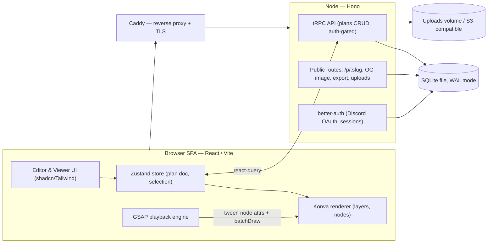
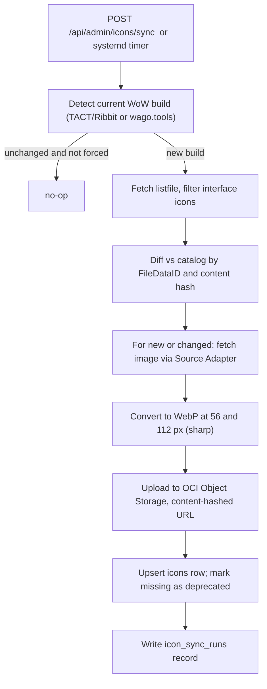

# RaidPlans — Implementation Plan

A self-hosted web app for creating and sharing animated World of Warcraft raid/arena plans, deployed at **https://raidplans.mamzer.dev**. Authors drag predefined icons onto a map "canvas", arrange them, and animate them PowerPoint‑style (appear, disappear, fade, move) across steps. Guild members view the plans (read‑only) with playback controls.

This document is written so that a professional developer **or** another AI agent can follow it end‑to‑end. It is organised as **Phases → Steps**, each phase producing something runnable, with acceptance criteria.

> **Target environment.** Production runs on **Oracle Linux 10** (RHEL‑compatible: `dnf`, `systemd`, `firewalld`, SELinux enforcing) on an **Oracle Cloud Ampere A1 ARM** VM (`aarch64`). **Development requires Linux or WSL2** (Ubuntu recommended). Mind the arch split: the Vite frontend is architecture‑independent, but native modules (`better-sqlite3`) are built per‑platform — run `pnpm install`/build **on the ARM server itself** and never copy `node_modules` from an x64 dev box to the `aarch64` host.

---

## 1. Goals & Non‑Goals

**Goals**
- Nice‑looking, fast **canvas editor**: drag & drop predefined icons onto a map, move/resize/rotate, style, label.
- **PowerPoint‑style animation**: per‑object entrance/exit/emphasis/motion effects, organised into **steps** the viewer clicks through.
- **Viewer mode** for the guild: read‑only playback, step navigation, fullscreen, shareable links.
- **Self‑hostable** on the user's own box/domain, low‑ops, with backups.
- **Performs well with 50+ objects/animations** at ~60 fps.

**Non‑Goals (initially)**
- Real‑time multi‑user co‑editing (deferred to Phase 6).
- Mobile *authoring* (viewer is mobile‑friendly; editing targets desktop).
- Deep game integrations (combat log, WeakAuras) — future.

---

## 2. Key Decisions (made for you — all reversible)

| Decision | Choice | Why | Alternative |
|---|---|---|---|
| Rendering | **Konva** (`react-konva`) over Canvas 2D | Built for interactive 2D scene graphs: drag/drop, transformers, hit‑testing, layers; comfortably handles 50–500 objects | SVG (simpler, slower at scale) · PixiJS/WebGL (overkill now, use if 1000s) |
| Animation | **GSAP** timeline | Best‑in‑class sequencing = exactly the "PowerPoint" model; tweens any property incl. Konva nodes; free incl. MotionPath | Konva.Tween (weaker sequencing) · Motion/anime.js |
| Animation UX model | **Steps + per‑object animations** | Matches "click through slides, each with entrance/exit effects" mental model; simpler than a global keyframe timeline | Global keyframe timeline (more power, more complexity) |
| App shell | **React + Vite + TypeScript (SPA)** | Your stated preference; the hard part (canvas) is client‑side either way | Next.js (SSR share pages) — noted as drop‑in if you want server‑rendered previews |
| State | **Zustand + Immer + zundo** | Minimal, fast, selective re‑renders; easy undo/redo | Redux Toolkit (heavier) |
| Backend | **Node + Hono**, **tRPC** for app API, plain routes for public/share | End‑to‑end TypeScript, tiny footprint, easy to self‑host | Fastify + REST · Next.js API routes |
| DB | **SQLite** via **Drizzle ORM** (`better-sqlite3`, WAL mode) | Light traffic → one file, no DB server, trivial backups, sub‑ms reads | Postgres — only if you later add real‑time collab or outgrow a single writer |
| Auth | **better‑auth** + **Discord OAuth** | Guilds already live on Discord; one‑click login, gate by guild | Battle.net OAuth (bonus: roster import) · email magic‑link |
| Repo | **pnpm workspace monorepo** (`apps/web`, `apps/api`, `packages/shared`) | Share the Plan schema (zod) → end‑to‑end types | Single package (fine, less type‑sharing) |
| Infra | **systemd‑managed Node process + Caddy** on Oracle Linux 10 / ARM — no Docker | Runs the API directly on the VM; Caddy gives automatic HTTPS with near‑zero config; Node/Caddy/SQLite all have first‑class `aarch64` support | Docker (declined) · nginx + certbot |

> Per your calls: **SQLite** (light traffic) and **no Docker** — the API runs as a native process behind Caddy. The decisions still worth confirming before Phase 4: the **auth provider** (Discord vs Battle.net vs email), the **animation model** (steps vs full keyframe timeline), and the **WoW icon source** for the sync service (official Battle.net API vs CASC/TACT extraction vs a mirror — see §11.1). Everything else is easy to swap.

---

## 3. Recommended Tech Stack

**Frontend (`apps/web`)**
- React 18 + TypeScript + Vite
- `konva` + `react-konva` — canvas rendering
- `gsap` (+ MotionPathPlugin) — animation/playback engine
- `zustand` + `immer` + `zundo` — editor state, immutable updates, undo/redo
- `@tanstack/react-query` — server cache (pairs with tRPC)
- `react-router-dom` — routes (`/`, `/plan/:id/edit`, `/p/:slug`)
- `tailwindcss` + `shadcn/ui` (Radix) — UI components
- `zod` — validation (schemas shared from `packages/shared`)
- `@tanstack/react-virtual` — virtualize the icon palette

**Backend (`apps/api`)**
- Node 20+ / TypeScript, **Hono** HTTP server
- **tRPC** router (app API) + plain Hono routes (public share, OG image, exports, uploads)
- **Drizzle ORM** + **SQLite** (`better-sqlite3`, WAL mode) — embedded, no separate DB server
- **better-auth** (Discord OAuth), session cookies
- `satori` + `@resvg/resvg-js` — OG/preview image generation (preferred on ARM: prebuilt `aarch64` binaries, no system libs; avoid `node-canvas` unless you install its native deps)
- `pino` (logging), `zod` (validation)
- `sharp` (image resize → WebP; arm64 prebuilds) — icon sync pipeline (§11.1)

**Shared (`packages/shared`)**
- The **Plan schema** (zod + inferred TS types), effect/enums, and pure helpers (state resolution). Imported by both web and api.

**Tooling / Infra**
- **Dev environment: Linux or WSL2 required** (Ubuntu recommended); Node 20/22 LTS via `nvm`/`fnm` + `corepack` for pnpm
- pnpm workspaces, ESLint, Prettier, Husky + lint‑staged
- Vitest + React Testing Library (unit/component), Playwright (E2E)
- GitHub Actions (typecheck, lint, test, build web + api artifacts)
- **No Docker:** the API runs as a native process under **systemd** on Oracle Linux 10 (`aarch64`)
- Caddy (native RPM/binary, auto‑TLS for `raidplans.mamzer.dev`) — serves the built `web` and reverse‑proxies the API
- Backups: `litestream` (continuous) → **OCI Object Storage** (S3‑compatible) or a nightly SQLite online‑backup copied off‑box

---

## 4. High‑Level Architecture



**Golden rule for performance:** React/Zustand own the document while **editing**; during **playback**, GSAP mutates Konva node properties directly and calls `layer.batchDraw()` — **no React re‑render per frame**.

---

## 5. Core Data Model

The single source of truth is a **Plan document** (JSON), validated by a shared zod schema and stored in the DB.

```ts
// packages/shared/src/plan.ts  (sketch)
type Transform = { x: number; y: number; w: number; h: number; rotation: number };

type PlanObject = {
  id: string;
  type: 'token' | 'marker' | 'shape' | 'text' | 'arrow' | 'image';
  iconId?: string;                 // ref into the icon manifest
  base: Transform & {
    opacity: number;               // 0..1
    tint?: string;                 // class color / custom
    label?: string;
    z: number;                     // stacking order
    visible: boolean;
  };
  locked?: boolean;
};

type AnimEffect = 'appear' | 'disappear' | 'fade' | 'fly' | 'move' | 'scale' | 'pulse' | 'blink';
type AnimTrigger = 'onEnter' | 'withPrevious' | 'afterPrevious' | 'onClick';

type Anim = {
  id: string;
  objectId: string;
  kind: 'entrance' | 'exit' | 'emphasis' | 'motion';
  effect: AnimEffect;
  trigger: AnimTrigger;
  delayMs: number;
  durationMs: number;
  easing: string;                  // GSAP ease name
  params?: { toX?: number; toY?: number; toOpacity?: number; path?: {x:number;y:number}[] };
};

type Step = {
  id: string;
  name?: string;
  // End-state deltas applied to objects when this step is "settled":
  overrides: Record<string /*objectId*/, Partial<Transform & { opacity: number; visible: boolean }>>;
  animations: Anim[];
  autoAdvanceMs?: number;          // optional autoplay
};

type Plan = {
  id: string;
  title: string;
  raid: string;                    // encounter/map id
  background: { assetId: string; width: number; height: number }; // native coords
  objects: PlanObject[];           // base object set (exists across steps)
  steps: Step[];                   // ordered "slides"
  schemaVersion: number;           // for migrations
};
```

**Coordinate system:** store all positions in the background's **native pixel space** (resolution‑independent). The Konva `Stage` is scaled to fit the container, so plans look identical on any screen.

**State resolution (pure function in `shared`):** given `objects` + previous step's settled state + current `step.overrides/animations`, compute the **start state** and **end state** for every object. The editor edits the end state; the viewer animates start→end. This is the "PowerPoint slide + animations" model, kept deterministic and testable.

**Persistence schema (SQLite, Drizzle):**
```
users(id, discord_id UNIQUE, name, avatar_url, created_at)
guilds(id, name, discord_guild_id)
memberships(user_id, guild_id, role /* owner|editor|viewer */, PRIMARY KEY(user_id,guild_id))
plans(id, slug UNIQUE, owner_id, guild_id, title, raid,
      visibility /* private|unlisted|public */, thumbnail_url,
      created_at, updated_at, deleted_at NULL)
plan_data(plan_id PK/FK, schema_version, doc TEXT, updated_at)   -- current document
plan_versions(id, plan_id, doc TEXT, created_at)                 -- optional history (Phase 6)
assets(id, owner_id, kind /* background|icon|upload */, url, width, height, created_at)
```
> The whole Plan lives as one **JSON text** blob (`plan_data.doc`, stored as `TEXT`; SQLite's JSON1 functions can query inside it if ever needed). It's small (tens of KB even with 50+ objects), trivial to load/save atomically, and versionable. Relational columns exist only for listing, access control, and search.

---

## 6. Canvas & Rendering Design

- **Layers (few, purposeful):** (1) background image, (2) interactive objects, (3) transformer/handles + selection UI, (4) transient overlays (alignment guides). Each Konva layer = one `<canvas>`; keep the count small.
- **Objects → nodes:** each `PlanObject` maps to a Konva node (`Image` for icons, `Rect/Circle/Arrow/Line/Text` for primitives). A React component per object via `react-konva`, keyed by id.
- **Interaction:** drag to move; `Konva.Transformer` for resize/rotate on selection; click/shift‑click multi‑select; marquee select; delete/duplicate; arrow‑key nudge; snap to grid + alignment guides.
- **Pan & zoom:** wheel zoom to cursor, space‑drag pan; clamp scale; fit‑to‑screen button. Store pan/zoom in view state (not in the plan doc).
- **Icon rendering:** preload each icon `Image` once into a cache keyed by `iconId`; reuse across all nodes. Consider a **sprite atlas** (single texture) for the palette + tokens to cut HTTP requests and memory.
- **Tokens:** composite node = icon + optional class‑color ring + name label; cache with `.cache()` so it draws as one bitmap.

---

## 7. Animation & Playback Design

**Authoring**
- Right‑panel "Animations" list for the **current step**: add per object, pick **kind** (entrance/exit/emphasis/motion) → **effect** (appear/fade/fly/move/scale/pulse/blink) → **trigger** (on enter / with previous / after previous / on click) → duration, delay, easing.
- **Motion** effects: drag a path on canvas (array of points) → animate along it (GSAP MotionPathPlugin).
- Live "Preview step" button re‑runs the timeline.

**Playback engine** (`apps/web/src/anim/`)
- On entering a step: read its `animations`, sort/compose into a **GSAP timeline**:
  - `withPrevious` → same start time; `afterPrevious` → appended; `onEnter` → at t=0; `onClick` → separate timeline advanced by click.
- Tween the **Konva node attributes** (`x, y, opacity, scaleX/Y, rotation`) directly; on each tick call `layer.batchDraw()`. **Do not** route frames through React.
- Controls: play / pause / restart / next‑step / prev‑step / scrub (seek the timeline) / speed. Keyboard: ←/→ steps, space play/pause.
- Entering a step first **snaps** all objects to that step's start state, then plays to the end state, so navigation is always consistent regardless of where you jump from.

**Viewer mode** reuses the same engine, read‑only, with a clean control bar, fullscreen, optional autoplay (`autoAdvanceMs`), and click/keyboard advance.

---

## 8. Performance Strategy (50+ objects & animations)

Design targets: **60 fps** playback and drag with 50–100 objects; graceful to a few hundred.

1. **Never re‑render React during animation.** GSAP mutates Konva nodes + `batchDraw()`. React only re‑renders on structural edits.
2. **Normalized store + fine‑grained selectors.** Zustand selectors so moving one object doesn't re‑render the other 49. Use `shallow` equality.
3. **Layer discipline.** Static background on its own layer (drawn once). Keep total layers ≤ 4. Redraw only the interactive layer during drag/playback.
4. **Node hygiene:** on static/non‑interactive nodes set `listening(false)`; disable `perfectDrawEnabled(false)` and `shadowForStrokeEnabled(false)`; avoid shadows/filters on many nodes (they force expensive redraws). `.cache()` composite tokens to a bitmap.
5. **Image caching / sprite atlas.** One `Image` per icon, reused; atlas to reduce draw calls and requests.
6. **Batch the timeline.** One GSAP timeline per step (not 50 independent tweens firing setState). GSAP already syncs to a single rAF.
7. **Virtualize the palette** (`react-virtual`) — hundreds of icons render only what's visible.
8. **Debounced autosave** (e.g. 1–2 s idle) with structural sharing (Immer); never serialize on every drag tick.
9. **Undo/redo** via Immer patches (zundo) — snapshotting 50 objects is cheap; store patches, not full copies.
10. **Escape hatch:** if you ever need thousands of nodes or particle‑like effects, swap the render layer to **PixiJS/WebGL** behind the same store/engine interface. The data model and animation engine stay unchanged.
11. **Measure:** add an FPS meter + Konva `Stage` draw stats in dev; profile a 50‑object, 4‑step plan each phase.

---

## 9. Backend & API

- **tRPC router** (auth‑gated app API):
  - `plan.create`, `plan.list` (by guild/owner), `plan.get`, `plan.saveDoc` (debounced autosave, optimistic), `plan.rename`, `plan.duplicate`, `plan.setVisibility`, `plan.softDelete`.
  - `me.get`, `guild.members`.
- **Plain Hono routes** (public / non‑tRPC):
  - `GET /p/:slug` → serves the viewer HTML with **OG meta tags** (Discord unfurl).
  - `GET /p/:slug/og.png` → server‑rendered preview of step 1 (satori/resvg or konva‑node).
  - `GET /api/plan/:slug/export.png?step=n` → PNG export.
  - `POST /api/upload` → background/image upload (auth’d, validated).
- **Access control:** `private` = requires guild membership; `unlisted` = anyone with slug; `public` = listed. Enforce in a tRPC middleware + on public routes.
- **Validation:** every input parsed with the shared zod schemas. Rate‑limit uploads and writes.

---

## 10. Auth & Sharing

- **better‑auth** with **Discord OAuth**. On first login, create `user`; map the user to your guild via a configured `discord_guild_id` (optionally verify membership through Discord's API). Roles: owner/editor/viewer.
- Session cookies (httpOnly, SameSite=Lax, Secure in prod).
- **Sharing:** each plan has a short `slug`; the viewer route works for `unlisted`/`public` without login; `private` requires a session + membership.
- **Discord previews:** the OG image + title/description make pasted links unfurl nicely in the guild's Discord — a high‑value, low‑cost feature.
- **Optional Battle.net OAuth** (Phase 6): pull the guild roster to auto‑generate player tokens with class colors.

---

## 11. Asset / Icon Pipeline

Two distinct icon sources feed the palette:

- **A. Bundled app icons** (shipped in the repo, versioned): raid target markers (skull/cross/square/moon/star/circle/diamond/triangle), generic shapes (circle/rect/cone/line/arrow), role icons (tank/heal/dps), UI glyphs. Small, curated, original or clearly‑licensed art. Manifest `{ id, category, name, file, tags[] }` → packed into a **sprite atlas** for the palette + tokens.
- **B. Synced WoW icon catalog** (dynamic, refreshable): the large native library of spell/ability/item/class/spec icons, kept current with the live game by the **Icon Sync Service** (§11.1). Served from our own storage, searched via an API, referenced from plans by stable id.
- **Backgrounds:** curated arena/dungeon/raid maps bundled as assets, selectable via the raid/map picker; plus user uploads (Phase 4).
- **Build step:** generate a **sprite atlas** + preload list from the manifest.
- **⚠️ Licensing:** WoW icons/maps are **Blizzard's IP** — see the licensing note at the end of §11.1 for how each source is handled.

### 11.1 WoW Native Icon Sync Service

**Goal:** a refreshable catalog of the icons that exist in WoW, sourced from WoW itself, stored on our infra, exposed to the palette through a search API — with a `POST` endpoint (and a scheduled timer) that "refreshes" the catalog whenever Blizzard ships a new build.

**Two-source model.** The **index** (which icons exist) comes from the community **listfile** (wowdev's `community-listfile.csv`, filtered to `interface/icons/`) — it maps `FileDataID → name` (`spell_fire_fireball02`, `inv_sword_04`, …), is just a text file, and updates every patch. The **image bytes** come from a pluggable **Source Adapter** (below). Plans reference the **stable id**; the adapter is an implementation detail.

**Pipeline**



**Source adapter (pluggable — pick per environment):**

| Adapter | What it is | Pros | Cons |
|---|---|---|---|
| **Battle.net API + Media** | Official Game Data + `/media/...` endpoints | Licensed for non‑commercial fan use (with attribution); clean id↔icon mapping | Keyed by entity (item/spell/…), no bulk "all icons" list; needs a client id/secret |
| **Blizzard CDN via TACT/CASC** | Extract BLP textures from Blizzard's CDN for the live build | Authoritative, complete, auto‑updates per patch — the "proper" way | Most work: TACT/CASC + BLP→WebP; JS tooling is weak (C#/Python/Go stronger — shell out, or use `wow.export`/CascLib) |
| **Mirror / wago.tools** | Community datamining site: build info + file access | Simple bulk import; already decoded | Depends on a third party staying current |
| **Wowhead CDN (by name)** | `wow.zamimg.com/images/wow/icons/large/{name}.jpg` | Trivial per‑name fetch | Hotlinking is against Wowhead's wishes → **cache into our store, never hotlink at runtime** |

**Recommended strategy:** code against a small `IconSource` interface and run **two sources**: (1) **Battle.net API** for the *curated* sets — classes, specs, roles, and any spell/item resolved by id (ships in Phase 2's palette); (2) a **bulk source** for the giant searchable library — start with the *simplest* (mirror/wago.tools or cached Wowhead‑by‑name), keep **TACT/CASC** as the fully‑automated‑per‑patch upgrade. Swapping the bulk source later changes **no plan data and no frontend code**.

**Names → categories & search.** Tokenise the listfile name on `_` to derive a rough **category** (`spell` / `ability` / `inv`→item / `achievement` / `class` / `trade` …) and **search tags** ("fire", "sword", "frost"). Powers palette search with zero manual tagging.

**Catalog schema (SQLite, Drizzle):**
```
icons(id TEXT PK,            -- stable slug = icon name, e.g. "spell_fire_fireball02"
      file_data_id INTEGER,  -- WoW FileDataID (nullable for non-CASC sources)
      display_name, category, tags TEXT,   -- tags = JSON array
      url_56 TEXT, url_112 TEXT,            -- our storage URLs (content-hashed, immutable)
      content_hash, source,                -- source = 'bnet' | 'tact' | 'pack' | 'wowhead'
      first_seen_build, deprecated INTEGER DEFAULT 0, updated_at)
icon_sync_runs(id, started_at, finished_at, build, added, updated, removed, status, error)
```

**Endpoints**
- `POST /api/admin/icons/sync` — **admin/owner‑gated**; kicks off the job **async** (returns `{ runId }` — a first full pull can run minutes). Body: `{ force?: boolean, source?: 'bnet' | 'tact' | ... }`.
- `GET /api/admin/icons/sync/:runId` — run status/progress.
- `GET /api/icons?query=&category=&cursor=` — the palette's search/paginate feed (guild‑readable); returns `{ id, display_name, category, url_56 }[]` + cursor. **Never** dumps 40k rows.
- Images are static objects on OCI Object Storage / behind Caddy — immutable, long `Cache-Control`.

**Refresh detection & scheduling.** A **systemd timer** (e.g. weekly) hits the same job; it first reads the current build (TACT/Ribbit or wago.tools) and **no‑ops if unchanged** unless `force`. Diffs are **incremental**, so steady‑state refreshes fetch only the handful of icons a patch adds/changes.

**Stability contract (important).** Plans store the **stable icon id** (name/FileDataID), never a URL. Deprecated/removed icons are **retained** (flagged) so historical plans never break. Content‑hashed URLs let browser + CDN cache aggressively.

**Frontend integration.** The palette is a **virtualised grid** backed by `GET /api/icons` (server search + pagination), images `loading="lazy"`. Opening a plan resolves only the ids it actually uses and warms the Konva image cache for those.

**Sizing.** ~40k icons as 56px WebP ≈ a few KB each → well under ~200 MB total; trivial on OCI Object Storage. A curated subset (spell/ability/class/spec) is far smaller.

**⚠️ Licensing (per source).** WoW icons are **Blizzard's IP**. The **official Battle.net API** is the cleanest path (non‑commercial fan use with attribution — per Blizzard's API ToS). CASC/TACT extraction and Wowhead caching are community‑standard datamining but are still Blizzard's assets: keep the tool **private/guild‑gated**, **cache into your own storage** (don't hammer or hotlink third parties at runtime), add **attribution**, and **don't publicly redistribute** the icon pack. Prefer the official API wherever it covers what you need.

---

## 12. Implementation Phases

Estimates assume **one experienced full‑stack dev**; scale accordingly. Every phase ends in a runnable, demoable state.

### Phase 0 — Foundations (≈ 2–4 days)
- **0.1** Init pnpm monorepo: `apps/web`, `apps/api`, `packages/shared`; strict TS, path aliases.
- **0.2** Tooling: ESLint, Prettier, Vitest, Playwright, Husky + lint‑staged.
- **0.3** CI (GitHub Actions): install → typecheck → lint → test → build.
- **0.4** Native run setup on the ARM VM: a **systemd** unit for the API + a Caddy config serving a placeholder page over HTTPS — prove the no‑Docker deploy path early (incl. firewalld + the OCI security‑list ingress rules).
- **0.5** DNS/TLS + network: point `raidplans.mamzer.dev` at the VM's public IP; open TCP **80/443 in BOTH the OCI VCN security list AND firewalld**; Caddyfile with automatic TLS; document.
- **0.6** Draft the shared **Plan zod schema** in `packages/shared` — the contract everything else builds on.
- **Acceptance:** `pnpm dev` runs empty web+api; CI green; Caddy serves a placeholder over HTTPS with the API running under the process manager.

### Phase 1 — Canvas MVP, no backend (≈ 3–5 days)
- **1.1** Vite React shell: routing, Tailwind, editor layout (toolbar / left palette / center canvas / right panel / bottom strip).
- **1.2** Konva `Stage`/`Layer`; virtual‑coordinate space + fit‑to‑container scaling; wheel zoom + space‑pan.
- **1.3** Render a background map image on the background layer.
- **1.4** Zustand store: normalized `objects`; add / select / move / delete.
- **1.5** Objects as Konva images: drag to move, click to select, Delete to remove.
- **1.6** Minimal palette (5–10 hardcoded icons) → click/drag to add.
- **Acceptance:** add 10 icons, drag smoothly, delete; positions stable across zoom/resize.

### Phase 2 — Full single‑board editor, local persistence (≈ 1–2 weeks)
- **2.1** Asset pipeline: bundled markers/shapes/role icons (manifest + **sprite atlas**) **plus** a curated WoW class/spec icon set (Battle.net API or bundled); preloaded image cache; searchable, **virtualized** palette. *(The full synced catalog lands in 4.9 — the palette API is designed for it now.)*
- **2.2** `Konva.Transformer`: resize/rotate handles; rotation snap; aspect constraints.
- **2.3** Properties panel: x/y, size, rotation, opacity, tint, label, lock, z‑order.
- **2.4** Primitive tools: text labels; shapes (rect/circle/cone); freehand/anchored **arrows & movement paths**.
- **2.5** Player tokens (class‑color ring + role + name) and raid markers.
- **2.6** Editing UX: grid + snapping, alignment guides, multi‑select, group move, copy/paste/duplicate, layer ordering, lock/hide.
- **2.7** Undo/redo (zundo/Immer patches) + keyboard shortcuts.
- **2.8** Local persistence: serialize plan → JSON; localStorage autosave; import/export `.json`.
- **2.9** Map/raid selector from the bundled background set.
- **Acceptance:** build a 30‑token board, adjust every property, undo/redo works, export→import round‑trips, autosave restores after reload.

### Phase 3 — Animation & Steps (≈ 1–2 weeks)
- **3.1** Extend schema: `steps[]` with per‑step `overrides` + `animations`; migrate local persistence.
- **3.2** Steps strip UI: add / duplicate / reorder (drag) / delete steps; per‑step thumbnails; "editing step N".
- **3.3** Pure **state resolution** (start/end per object per step) in `shared`, with unit tests.
- **3.4** Animation authoring UI: add/edit animations (kind → effect → trigger → delay/duration/easing); motion‑path drawing.
- **3.5** **GSAP playback engine**: compile a step into a timeline; tween Konva nodes; `batchDraw`; play/pause/scrub/step nav; **no React re‑render per frame**.
- **3.6** Viewer mode (read‑only): control bar, step nav, fullscreen, optional autoplay, keyboard/click advance.
- **3.7** **Performance pass**: layer strategy, node caching, disable shadows/listening on static, atlas, FPS meter; hit 60 fps with 50 objects / 4 steps.
- **Acceptance:** a 4‑step, 50‑object plan plays at ~60 fps; scrubbing and jump‑to‑step are consistent; viewer navigates cleanly.

### Phase 4 — Backend, auth, persistence, sharing (≈ 1–2 weeks)
- **4.1** `apps/api` Hono app + tRPC router; Drizzle + **SQLite** (`better-sqlite3`, WAL + `busy_timeout`); migrations.
- **4.2** DB schema (users, guilds, memberships, plans, plan_data, assets).
- **4.3** Auth: better‑auth + Discord OAuth; sessions; guild gating; roles.
- **4.4** Plan CRUD wired to the editor: create/list/load; **debounced optimistic autosave**; rename/duplicate/soft‑delete.
- **4.5** Visibility (private/unlisted/public) + share slugs + access checks.
- **4.6** Public viewer route `/p/:slug` (no login for unlisted/public).
- **4.7** OG preview image (server render of step 1) + meta tags for **Discord unfurl**.
- **4.8** Uploads: custom backgrounds → local volume or S3/MinIO; validation & limits.
- **4.9** WoW Icon Sync Service (§11.1): `icons` + `icon_sync_runs` tables; pluggable `IconSource` adapter (Battle.net API for curated sets; TACT/CASC or a pack for bulk); `POST /api/admin/icons/sync` (async, admin‑gated) + `GET /api/icons` search feed; BLP/JPG→WebP via `sharp`; upload to OCI Object Storage; **systemd timer** for scheduled refresh with incremental build diffing; deprecated‑icon retention.
- **Acceptance:** two guild members log in via Discord; one creates & shares a plan; the other views it; the link unfurls in Discord. A `POST /api/admin/icons/sync` run populates the WoW icon catalog and the palette searches it.

### Phase 5 — Polish, export, deploy (≈ 1 week)
- **5.1** Export: PNG per step (`toDataURL`); optional animated export (canvas `captureStream` → WebM) as nice‑to‑have.
- **5.2** Dashboard: plan list with thumbnails/search/tags; templates & duplication; starter plans.
- **5.3** Mobile‑friendly viewer; responsive tweaks; accessibility pass (keyboard nav, ARIA on panels/dialogs).
- **5.4** Error handling, empty states, toasts, skeletons; logging (pino) + basic metrics; optional Sentry.
- **5.5** Hardening: zod validation everywhere, authz tests, rate limiting, session/CSRF security, upload safety.
- **5.6** Production deploy on Oracle Linux 10 / ARM (no Docker): build `web` → static; run the API under **systemd**; **Caddy** (RPM) for TLS + static + reverse proxy; firewalld + OCI security‑list rules; SELinux contexts as needed; env/secrets; **SQLite backups** via `litestream` → OCI Object Storage (+ uploads); `/healthz`; documented update & restore runbook.
- **Acceptance:** fresh deploy reproducible from the runbook; backup+restore verified; a 50‑object plan is smooth in production at `https://raidplans.mamzer.dev`.

### Phase 6 — Future / optional
- Real‑time collaboration (Yjs + `y-websocket`, presence/cursors).
- Comments/annotations; plan version history + diff.
- Battle.net OAuth + **guild roster import** (auto‑create class‑colored player tokens).
- Boss ability timers / imported cooldown timelines.
- Community template library; cloning; reactions; i18n; PDF/print export.

---

## 13. Testing & QA

- **Unit (Vitest):** state resolution, schema validation/migrations, animation timeline compilation, store reducers, access‑control helpers.
- **Component (RTL):** palette, properties panel, steps strip, animation editor.
- **E2E (Playwright):** create → place → animate → save → open viewer → play; auth flow; sharing/visibility; import/export round‑trip.
  - **Testing protected flows without Discord:** the API's `DEV_AUTH` flag (dev/CI only — `loadConfig` refuses it in production) exposes `/api/dev/login?userId=…`, which mints a session cookie for any user. Being an admin comes from `ICON_ADMIN_USER_IDS`, so dev‑login as an allowlisted id to reach admin routes. For manual work: `pnpm dev:auth`, then visit `/api/dev/login?userId=me`. For E2E: the signed‑in suite (`pnpm --filter @raidplan/web test:e2e:auth`, config `playwright.auth.config.ts`) boots a throwaway API (in‑memory DB, `DEV_AUTH`) and a `signIn()` helper — kept separate so the default suite stays hermetic.
- **Performance:** scripted 50‑object/4‑step scene with an FPS assertion in CI (allow a threshold) to catch regressions.
- **Manual QA checklist** per release: zoom/pan, snapping, undo/redo depth, keyboard shortcuts, mobile viewer, Discord unfurl.

---

## 14. Deployment & Ops

- **Target:** Oracle Linux 10 (RHEL‑compatible) on an Oracle Cloud Ampere A1 ARM VM (`aarch64`; free tier gives up to 4 OCPU / 24 GB — ample). Node, Caddy, SQLite, and litestream all ship first‑class arm64 builds.
- **Topology (no Docker):** **Caddy** (native, TLS + reverse proxy) serves the built `web` static files and proxies `/api`, `/trpc`, `/p/*` to the Node API on `localhost:4000`; the API is a **systemd** service; **SQLite** is a file on local disk (WAL mode); uploads live in a local directory (or OCI Object Storage). No database server, no containers. *(Option: let Hono serve the static files too, so Caddy is only a TLS front.)*
- **One‑time install:** Node 20/22 LTS (`nvm`/`fnm` or NodeSource) + `corepack enable` (pnpm); build tools so `better-sqlite3` can compile if no arm64 prebuilt matches your Node ABI — `sudo dnf group install "Development Tools"` + `python3`; Caddy from its official RPM repo (`sudo dnf install caddy`), which brings an arm64 binary and a systemd unit.
- **Networking — two layers (classic Oracle gotcha):** open TCP **80 and 443** in BOTH (1) the **OCI VCN security list / NSG** (Cloud console) and (2) instance **firewalld** — `sudo firewall-cmd --permanent --add-service=http --add-service=https && sudo firewall-cmd --reload`. Missing either breaks ACME/TLS.
- **SELinux (enforcing — keep it):** label the web root (`sudo semanage fcontext -a -t httpd_sys_content_t "/srv/web(/.*)?" && sudo restorecon -R /srv/web`); if the Caddy→API proxy is denied, `sudo setsebool -P httpd_can_network_connect on`. Diagnose denials with `sudo ausearch -m avc -ts recent`.
- **API service:** a `raidplans-api.service` systemd unit — `ExecStart=/usr/bin/node apps/api/dist/server.js`, `EnvironmentFile=/etc/raidplans/env`, `User=raidplans`, `Restart=on-failure`; `sudo systemctl enable --now raidplans-api`.
- **Caddyfile (essence):** `raidplans.mamzer.dev { encode gzip; reverse_proxy /api/* localhost:4000; reverse_proxy /trpc/* localhost:4000; reverse_proxy /p/* localhost:4000; root * /srv/web; file_server }` — automatic TLS via Let's Encrypt (requires 80/443 reachable per above).
- **SQLite tuning:** WAL mode + `busy_timeout` (~5 s) so reads never block the single writer; `better-sqlite3` is synchronous and sub‑millisecond for these tiny JSON reads/writes.
- **Config/secrets:** `/etc/raidplans/env` (SQLite path, Discord id/secret, session secret, base URL), `chmod 600`, never committed.
- **Backups:** the DB is one file — **litestream** replicates it continuously to **OCI Object Storage** (S3‑compatible endpoint; same cloud, cheap) *or* a nightly `sqlite3 app.db '.backup backup.db'` copied off‑box. Also back up the uploads dir. **Test restore before go‑live.**
- **Updates:** on the VM — `git pull` → `pnpm install` (rebuilds arm64 native modules) → `pnpm build` → `sudo systemctl restart raidplans-api`; `sudo systemctl reload caddy` if its config changed. **Never** copy `node_modules` from an x64 dev box to the arm64 host.
- **Observability:** pino → journald (`journalctl -u raidplans-api -f`), a `/healthz` endpoint, an external uptime check; optional Sentry for the SPA.

---

## 15. Risks & Mitigations

| Risk | Mitigation |
|---|---|
| Jank with many animated objects | Imperative GSAP↔Konva (no per‑frame React), layer discipline, caching, FPS meter in CI (Phase 3.7 / §8) |
| Asset licensing (Blizzard IP) | Keep it private/non‑commercial; source‑attributed swappable manifest; prefer Battle.net media / CC art (§11) |
| Animation model too limited later | Data model already supports triggers/paths; can graduate to a full keyframe timeline without changing storage |
| Self‑host maintenance burden | No Docker: one systemd‑managed Node process + Caddy auto‑TLS + single‑file SQLite + documented runbook & automated backups keep ops minimal |
| ARM / Oracle Linux specifics | `aarch64` is first‑class for Node/Caddy/SQLite/litestream; install "Development Tools" so `better-sqlite3` can build; mind the **dual firewall** (OCI security list + firewalld) and **SELinux** — all covered in §14 |
| SQLite write contention | WAL mode + `busy_timeout`; a single writer is fine at guild scale and the JSON‑blob writes are tiny and debounced. Only revisit (→ Postgres) if you add real‑time collab (Phase 6) |
| Scope creep | Phases are independently shippable; collaboration/extras are explicitly Phase 6 |
| Data loss on autosave races | Debounced optimistic writes with a `version`/`updated_at` check; last‑write‑wins is acceptable single‑editor, revisit for Phase 6 collab |

---

## 16. First‑Week Concrete Tasks (quick start)

1. `pnpm init` workspace; scaffold `apps/web` (Vite React TS), `apps/api` (Hono), `packages/shared`.
2. Add Tailwind + shadcn to `web`; lay out the 5‑region editor shell.
3. Drop in Konva: render a background image, place one draggable icon, wire a Zustand store.
4. Write the first cut of the **Plan zod schema** in `shared` and make the store use it.
5. Add ESLint/Prettier/Vitest + a GitHub Actions CI that typechecks and tests.
6. On the ARM VM: install Node + Caddy, open 80/443 (OCI security list *and* firewalld), and serve a placeholder over HTTPS under **systemd** — prove the no‑Docker deploy path early.

Deliver Phase 1's acceptance criteria by end of week 1; you now have a spine to hang everything else on.

---

## 17. Encounter Presets & Attack Designer (epic)

An **admin panel** with two jobs, plus the matching planner-side flow. Decisions
taken with the maintainer; see the memory note `encounter-attack-designer`.

- **Encounter presets** — admin defines *raid → encounter → { background, curated
  token roster, optional pre-placed objects }*. The planner picks a raid + encounter
  and gets a pre-seeded plan. A preset is essentially a template `Plan`; a new plan
  clones its preset content.
- **Attack designer** — admin pre-designs *attacks* (multi-object animated mechanics)
  per encounter. The planner drops one in and only adjusts **position + timing**; an
  attack is an **indivisible** unit (can't be dismantled or hand-animated).

**Key architecture decisions**

- **Attacks use a reference / instance model, not baked groups.** A plan stores only an
  `AttackInstance { attackId, version, x, y, rotation, scale, startMs, params }`; the
  internals live in an `AttackDef` authored in the designer. A shared
  `expandStep(step, defs) → { objects, anims }` (beside `resolveObjectState`) is the one
  place instances become concrete, and Konva, the OG SVG renderer and the WebM exporter
  all consume its output — so they can't diverge. Indivisibility is a property of the
  data: there is nothing in the plan doc to select.
- **Backgrounds are admin-uploaded original battlemaps** (no Blizzard art — keeps the §11
  stance). Reuses the existing upload pipeline (`assets.kind = "background"`,
  `isUploadedAsset`, `/uploads/…`); an encounter references the uploaded `assetId`.
- Attack instances live **per step**: `Step` gains `attacks: AttackInstance[]` alongside
  `animations`. The designer *is* the existing editor, admin-scoped, plus marking the
  anchor object and which values are exposed knobs.
- Admin gating: an `adminProcedure` generalizing `isIconAdmin(viewer, adminUserIds)` over
  the same allowlist.

**Open decision (before Stage 3):** when an admin edits an attack def, do dependent plans
auto-follow the latest version or stay pinned? Leaning auto-follow + a visible "updated"
marker for v1; add pinning later.

**Stages** (each independently shippable, green per commit)

1. **Encounter registry + preset → new-plan flow.** `EncounterPreset` schema in shared;
   `encounters` table + repo + idempotent seed; `encounter.list`; `plan.create` accepts an
   `encounterId` and seeds the doc from the preset; the home page's new-plan control becomes
   an encounter selector (grouped by raid), with the bundled maps kept as a fallback. Seeds
   re-express today's three bundled maps as a "Sandbox" raid so there's no regression and no
   dependency on an icon sync. *(Roster curation of the left palette is a follow-up slice —
   it needs the plan to reference its encounter and touches the icon palette.)*
2. **`adminProcedure` + admin panel shell** [DONE] — CRUD encounters and upload
   battlemaps at `/admin`, gated by a site-admin allowlist. *(Roster curation is
   deferred with the left-palette work; the panel edits name/raid/background.)*
3. **`AttackDef`/`AttackInstance` schema + `expandPlan` wired into the renderers** [DONE] —
   the architectural core. A plan stores only instances; the pure `expandPlan(plan, defs)`
   stamps them into an ordinary Plan (namespaced objects, per-step visibility overrides,
   transformed anims), so every renderer draws attacks for free. Wired into the OG preview
   (server) and the viewer (Konva). *Auto-follow* by `attackId`. WebM inherits attacks once
   the editor renders placed instances (stage 5), since it captures that stage. v1 def
   effects are the params-driven set; `scale`/`fly`-to-target need a def end-state (follow-up).
4. **Attack designer** [DONE] — the editor, admin-scoped. An `AttackDef` is a one-step
   mini-plan, so `defToPlan`/`planToAttackContent` load it onto the shared store and the same
   canvas/palette/panels author it; a **Layout | Animate** toggle switches between base
   placement and the single step's end-state + animations. Admin attack CRUD
   (`attack.create/update/remove/get`) behind `adminProcedure`; `/admin/encounters/:id/attacks`
   lists and the designer saves. Verified by a signed-in e2e. *(Custom exposed knobs beyond
   position/rotation/scale/timing, and an interactive on-canvas anchor handle, are follow-ups —
   the anchor is set numerically for now.)*
5. **Planner side** [MOSTLY DONE] — `Plan.encounterId` records which encounter seeded a plan,
   so the editor offers *that* encounter's attacks. Store actions place/retune/remove instances,
   and an Attacks panel drops one on the current step and tunes x/y, rotation, scale and start
   offset. Placed attacks already render in the **viewer** and the **share preview** (stage 3).
   **Remaining:** an in-editor canvas preview of a placed attack. `ObjectNode` resolves what it
   draws from the store, so it can't draw an attack's *expanded* (ephemeral) objects; that needs
   its drawing split from its selection/drag behaviour. The same change lets the **WebM export**
   — which captures the live editor stage — include attacks. Until then the planner positions
   numerically and checks the result in the viewer.

---

## 18. Groups, and the attack library rebuilt around them

§17 shipped attacks end-to-end, but the authoring/placing UX was wrong: attacks lived in a
right-hand panel tuned by typing numbers, definitions were authored in absolute pixels, and
`collideWith` was baked into a definition that cannot know a plan's objects. This section
rebuilds that on a **grouping** primitive.

**Three findings make this cheaper than it looks.** `SelectionTransformer` already attaches to
*multiple* nodes and `ObjectNode` already folds per-node scale back into `w`/`h`, so rigid
multi-object transform exists today; the left palette already has tabs and a drag payload; and
`ObjectVisual` is already a store-free renderer.

**Decisions taken (user):** placing an attack keeps it a **live reference** (indivisible,
auto-following) that merely *behaves* like a group; definitions are authored in **-1..1 centred**
unit space; and there is **no migration** — the schema changes outright (bump `SCHEMA_VERSION`).

### 18.1 Grouping

`PlanObject.groupId?` — a group exists when ≥2 objects share one; an optional `Plan.groups`
record holds names. The feature is mostly **selection resolution**: clicking a member selects
every member, and because `selectedIds` already drives the multi-node transformer, rigid
move/scale/rotate comes for free. Group/ungroup are two store actions; members stay contiguous
in z-order. Double-click-to-enter is a later nicety.

### 18.2 Attacks in unit space; instances as rects

- Definition content — object positions **and** sizes, plus animation `toX`/`toY` and paths — is
  authored in **-1..1 centred** unit space. Nothing absolute.
- An instance becomes a **rect**: `{ x, y, w, h, rotation, startMs, args }`. `scale` and `anchor`
  disappear; the rect *is* the placement, which is exactly what a Konva `Transformer` edits.
- Expansion maps `plan = centre + unit × (size/2)`, then rotates about the rect centre. Lengths
  scale by `w/2` and `h/2` independently, so non-uniform resize stretches an attack — Shift
  preserves aspect.
- **Codified constraint:** a definition is exactly *base state + one step*.

### 18.3 Attacks as canvas citizens

Each instance renders as a Konva `Group` (id = instance id, draggable) whose expanded children are
drawn read-only through `ObjectVisual`. It joins selection and the transformer, so it is moved,
scaled and rotated like any object — but never entered, because it is indivisible. This **removes
the numeric `AttacksPanel`**; only timing and parameters remain in a properties panel.

### 18.4 Parameters

A definition declares `params: [{ key, label, type, default }]` over
`objectRefs | number | color | text | boolean`; an instance supplies `args`. Internals bind through
**typed slots** rather than a template language (an animation's `collideWithParam`, an object's
`tintParam`, an animation's `durationParam`), so binding stays typed and testable. `expandPlan`
resolves them from `args` with defaults as fallback — which is how **`collideWith` stops being
hardcoded** and starts pointing at real plan objects. **Parameter sets** are named, reusable
argument bundles ("Tanks" → [tankA, tankB]) so a planner picks rather than re-selects.

### 18.5 Also folded in

1. Shapes/mechanics move from the toolbar into the palette as a third tab (that toolbar is full).
2. Drag-and-drop placement for attacks and shapes — drop at the cursor, as icons already do.
3. Thumbnails in the attack palette; a library has to be browsable.
4. Attack bars in the step timeline, so `startMs` is dragged rather than typed.
5. An "updated" badge when a definition changed since an instance was placed (uses `version`).
6. Copy/paste/duplicate of instances, once they're ordinary canvas citizens.

### 18.6 Stages

1. **Grouping** [DONE] — `PlanObject.groupId?`; selection expands to the whole group at the one
   choke point `select`/`toggleSelect` share, so the existing multi-node transformer moves a
   group rigidly with no new maths. Ctrl+G / Ctrl+Shift+G.
2. **Attack model v2** [DONE] — definitions entirely in -1..1 centred unit space; an instance is
   a rectangle `{x,y,w,h,rotation,startMs,args}`. `defToPlan`/`planToAttackContent` are the only
   places unit space is entered or left, so the designer kept working in pixels unchanged.
   SCHEMA_VERSION → 2, clean break.
3. **Canvas instances** [DONE] — one invisible frame per instance is the click/drag/transform
   target and what the Transformer attaches to; the drawn parts stay absolute and inert so the
   WebM exporter can still drive them by id.
4. **Palette** [DONE] — Attacks and Shapes tabs with drag-drop; attack thumbnails are the
   definition drawn into a `-1 -1 2 2` viewBox. Shapes left the toolbar; Tether stayed, being an
   operation on a selection.
5. **Parameters** [DONE] — declared on the def, answered per instance, read through typed slots
   (`collideWith`/`durationMs`/`tint`). A *bound* collideWith names plan objects, so those ids
   are used as given rather than namespaced. **Still open: reusable parameter *sets*** (named
   bundles like "Tanks" → [tankA, tankB]).
6. **Timeline bars** [DONE] — a placed attack gets a bar at `startMs`, as long as its definition
   runs, dragged or arrow-keyed like an animation. The right edge **stretches** it: an instance
   `durationMs` scales the whole bundle, so a 1000ms attack pulled to 2000ms plays exactly as
   authored at half speed. (Originally specced without a duration handle, on the grounds that an
   attack's length belongs to its definition — which is still true: stretching doesn't edit the
   definition, and an instance that has never been stretched keeps following it.)

Net effect: the attacks panel has **no number boxes left** — the palette places, the canvas
positions and sizes, the timeline says when, and the panel carries only the arguments the
definition asked the plan for.

### 18.7 Corrections after first real use

Three things the first hands-on pass found, each a hole in §18.2–18.3 rather than a slip:

1. **Attacks were invisible during playback.** Parts are materialised hidden (that's what keeps
   them off neighbouring steps) and nothing tweens `visible`, so without an entrance an attack
   played out unseen; and `ObjectNode` unmounted hidden objects, leaving GSAP nothing to find by
   id. Now: parts without an entrance get an implicit `appear` when the attack fires, and hidden
   objects keep their node (`visible={false}`). While there, a def's internal trigger chain is
   flattened onto absolute delays as it joins its host step, so an attack can't chain off the
   plan's own animations and `startMs` shifts it exactly once. The pure timing model moved to
   `@raidplan/shared` so expansion and the player share one implementation. [DONE]
2. **The instance rectangle wasn't the attack's bounding box.** Unit space is now pinned to the
   attack's own extent (`attackContentBox`, measured across base + end state + motion paths), and
   expansion maps *that* onto the rect — so old definitions self-correct too. Saving from the
   designer shrink-wraps to match and measures `defaultSize`, which deletes the hand-typed size
   boxes; the designer draws the box instead. [DONE]
3. **An attack alone on a plan didn't count as content.** Autosave (local and remote) and undo
   each compared their own hand-written list of document slices, none of which had heard of
   `attacks` — so a plan whose only content was an attack never saved, and everything downstream
   (reload, viewer, share preview) saw an empty plan. The slices are now named once, as a *total*
   record over `PlanDoc`, so the next field added to the document is a compile error rather than
   a plan that silently stops saving. Counts include attacks, a duplicated step brings its
   attacks, and deleting an object drops it from any attack argument naming it. [DONE]
4. **An attack couldn't be placed from the base layout.** Placement is a property of the board,
   firing is a property of one step — so instances moved from `Step.attacks` to `Plan.attacks`,
   each carrying `stepId`. Placing from the base layout pins the attack to the first step,
   creating one if the plan has none. The canvas shows every attack, dimming the ones that fire
   elsewhere; the panel says which step fires each. SCHEMA_VERSION → 3, clean break. [DONE]

---

*End of plan. Suggested next actions: (a) confirm the three key decisions in §2, then (b) scaffold Phase 0–1, or (c) turn this document into a checklist/issue tracker.*

### 18.8 Parameters, made legible and reusable

The mechanism worked; nothing explained it, so it read as a dead end. A parameter has **two**
halves — declare it, then point it at something inside the attack — and only the first was
visible. Now: the panel says what a parameter is and what the plan will be asked for; binding
targets read `move · Cone` rather than `move`, which is unusable the moment an attack has three
moves; an unbound parameter, a type nothing can read (`text`/`boolean`), and "no animation to
drive yet" each say so where the control would be. The e2e authors a parameter, binds it, saves,
reopens to prove the binding survived, and then ticks a plan object for it in a plan — the whole
loop in one test. [DONE]

**One parameter, many places.** The storage was always keyed by *target*
(`Record<targetId, paramKey>`), so many-to-one was already expressible; only the UI
insisted on a single choice. Each place is now a tick-box, so one "Tanks" answer feeds every
animation that needs to know who the tanks are. The reverse stays single — a place reads from
exactly one parameter — and a place another parameter has already claimed shows as taken, with
whose it is, rather than as a box that won't tick. A number gained a second slot (`delayMs`
beside `durationMs`), because "a number can only ever mean a duration" was arbitrary; bound
delays settle before the chain lays out, exactly like bound durations. [DONE]

### 18.9 The properties column inspects the selection

With the Timeline showing a step whole, the Animation panel listing *every* animation on the step
was a second, worse overview: a busy step became a wall of dropdowns, and the column stopped
being about what you had picked. It now lists only the selected objects' animations, says how
many it isn't showing ("3 more on this step — see the timeline") so nothing goes missing quietly,
and asks for a selection rather than falling back to everything. Clicking a bar in the timeline
selects its object, so the overview and the inspector navigate to each other. `+ Animate
selection` takes a whole selection — one store action rather than a loop, so animating a group of
six is a single undo, and the animations land in document order. [DONE]
