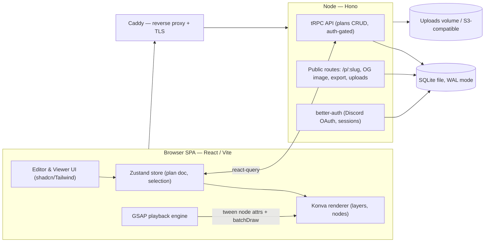
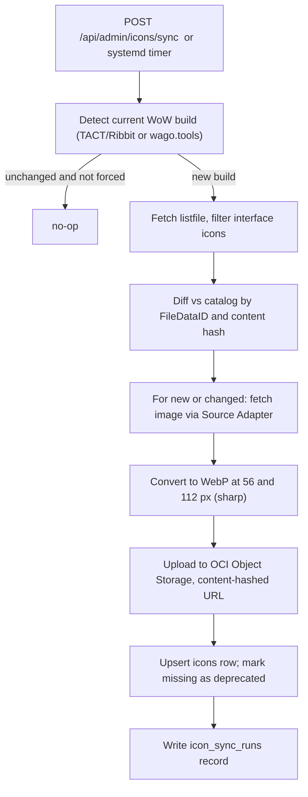

# RaidPlans — Implementation Plan

A self-hosted web app for creating and sharing animated World of Warcraft raid/arena plans, deployed at **https://raidplans.mamzer.dev**. Authors drag predefined icons onto a map "canvas", arrange them, and animate them PowerPoint‑style (appear, disappear, fade, move) across steps. Guild members view the plans (read‑only) with playback controls.

This document is written so that a professional developer **or** another AI agent can follow it end‑to‑end. It is organised as **Phases → Steps**, each phase producing something runnable, with acceptance criteria.

> **Target environment.** Production runs on **Oracle Linux 10** (RHEL‑compatible: `dnf`, `systemd`, `firewalld`, SELinux enforcing) on an **Oracle Cloud Ampere A1 ARM** VM (`aarch64`). **Development requires Linux or WSL2** (Ubuntu recommended). Mind the arch split: the Vite frontend is architecture‑independent, but native modules (`better-sqlite3`) are built per‑platform — run `pnpm install`/build **on the ARM server itself** and never copy `node_modules` from an x64 dev box to the `aarch64` host.

---

## 1. Goals & Non‑Goals

**Goals**
- Nice‑looking, fast **canvas editor**: drag & drop predefined icons onto a map, move/resize/rotate, style, label.
- **PowerPoint‑style animation**: per‑object entrance/exit/emphasis/motion effects, organised into **steps** the viewer clicks through.
- **Viewer mode** for the guild: read‑only playback, step navigation, fullscreen, shareable links.
- **Self‑hostable** on the user's own box/domain, low‑ops, with backups.
- **Performs well with 50+ objects/animations** at ~60 fps.

**Non‑Goals (initially)**
- Real‑time multi‑user co‑editing (deferred to Phase 6).
- Mobile *authoring* (viewer is mobile‑friendly; editing targets desktop).
- Deep game integrations (combat log, WeakAuras) — future.

---

## 2. Key Decisions (made for you — all reversible)

| Decision | Choice | Why | Alternative |
|---|---|---|---|
| Rendering | **Konva** (`react-konva`) over Canvas 2D | Built for interactive 2D scene graphs: drag/drop, transformers, hit‑testing, layers; comfortably handles 50–500 objects | SVG (simpler, slower at scale) · PixiJS/WebGL (overkill now, use if 1000s) |
| Animation | **GSAP** timeline | Best‑in‑class sequencing = exactly the "PowerPoint" model; tweens any property incl. Konva nodes; free incl. MotionPath | Konva.Tween (weaker sequencing) · Motion/anime.js |
| Animation UX model | **Steps + per‑object animations** | Matches "click through slides, each with entrance/exit effects" mental model; simpler than a global keyframe timeline | Global keyframe timeline (more power, more complexity) |
| App shell | **React + Vite + TypeScript (SPA)** | Your stated preference; the hard part (canvas) is client‑side either way | Next.js (SSR share pages) — noted as drop‑in if you want server‑rendered previews |
| State | **Zustand + Immer + zundo** | Minimal, fast, selective re‑renders; easy undo/redo | Redux Toolkit (heavier) |
| Backend | **Node + Hono**, **tRPC** for app API, plain routes for public/share | End‑to‑end TypeScript, tiny footprint, easy to self‑host | Fastify + REST · Next.js API routes |
| DB | **SQLite** via **Drizzle ORM** (`better-sqlite3`, WAL mode) | Light traffic → one file, no DB server, trivial backups, sub‑ms reads | Postgres — only if you later add real‑time collab or outgrow a single writer |
| Auth | **better‑auth** + **Discord OAuth** | Guilds already live on Discord; one‑click login, gate by guild | Battle.net OAuth (bonus: roster import) · email magic‑link |
| Repo | **pnpm workspace monorepo** (`apps/web`, `apps/api`, `packages/shared`) | Share the Plan schema (zod) → end‑to‑end types | Single package (fine, less type‑sharing) |
| Infra | **systemd‑managed Node process + Caddy** on Oracle Linux 10 / ARM — no Docker | Runs the API directly on the VM; Caddy gives automatic HTTPS with near‑zero config; Node/Caddy/SQLite all have first‑class `aarch64` support | Docker (declined) · nginx + certbot |

> Per your calls: **SQLite** (light traffic) and **no Docker** — the API runs as a native process behind Caddy. The decisions still worth confirming before Phase 4: the **auth provider** (Discord vs Battle.net vs email), the **animation model** (steps vs full keyframe timeline), and the **WoW icon source** for the sync service (official Battle.net API vs CASC/TACT extraction vs a mirror — see §11.1). Everything else is easy to swap.

---

## 3. Recommended Tech Stack

**Frontend (`apps/web`)**
- React 18 + TypeScript + Vite
- `konva` + `react-konva` — canvas rendering
- `gsap` (+ MotionPathPlugin) — animation/playback engine
- `zustand` + `immer` + `zundo` — editor state, immutable updates, undo/redo
- `@tanstack/react-query` — server cache (pairs with tRPC)
- `react-router-dom` — routes (`/`, `/plan/:id/edit`, `/p/:slug`)
- `tailwindcss` + `shadcn/ui` (Radix) — UI components
- `zod` — validation (schemas shared from `packages/shared`)
- `@tanstack/react-virtual` — virtualize the icon palette

**Backend (`apps/api`)**
- Node 20+ / TypeScript, **Hono** HTTP server
- **tRPC** router (app API) + plain Hono routes (public share, OG image, exports, uploads)
- **Drizzle ORM** + **SQLite** (`better-sqlite3`, WAL mode) — embedded, no separate DB server
- **better-auth** (Discord OAuth), session cookies
- `satori` + `@resvg/resvg-js` — OG/preview image generation (preferred on ARM: prebuilt `aarch64` binaries, no system libs; avoid `node-canvas` unless you install its native deps)
- `pino` (logging), `zod` (validation)
- `sharp` (image resize → WebP; arm64 prebuilds) — icon sync pipeline (§11.1)

**Shared (`packages/shared`)**
- The **Plan schema** (zod + inferred TS types), effect/enums, and pure helpers (state resolution). Imported by both web and api.

**Tooling / Infra**
- **Dev environment: Linux or WSL2 required** (Ubuntu recommended); Node 20/22 LTS via `nvm`/`fnm` + `corepack` for pnpm
- pnpm workspaces, ESLint, Prettier, Husky + lint‑staged
- Vitest + React Testing Library (unit/component), Playwright (E2E)
- GitHub Actions (typecheck, lint, test, build web + api artifacts)
- **No Docker:** the API runs as a native process under **systemd** on Oracle Linux 10 (`aarch64`)
- Caddy (native RPM/binary, auto‑TLS for `raidplans.mamzer.dev`) — serves the built `web` and reverse‑proxies the API
- Backups: `litestream` (continuous) → **OCI Object Storage** (S3‑compatible) or a nightly SQLite online‑backup copied off‑box

---

## 4. High‑Level Architecture


```mermaid
flowchart LR
  subgraph Browser["Browser SPA — React / Vite"]
    UI["Editor & Viewer UI (shadcn/Tailwind)"]
    Store["Zustand store (plan doc, selection)"]
    Canvas["Konva renderer (layers, nodes)"]
    Anim["GSAP playback engine"]
    UI --> Store --> Canvas
    Anim -->|tween node attrs + batchDraw| Canvas
  end

  Caddy["Caddy — reverse proxy + TLS"]
  subgraph Server["Node — Hono"]
    TRPC["tRPC API (plans CRUD, auth-gated)"]
    REST["Public routes: /p/:slug, OG image, export, uploads"]
    Auth["better-auth (Discord OAuth, sessions)"]
  end
  DB[("SQLite file, WAL mode")]
  Files[("Uploads volume / S3-compatible")]

  Browser --> Caddy --> Server
  Store <-->|react-query| TRPC
  TRPC --> DB
  REST --> DB
  Auth --> DB
  Server --> Files
```

**Golden rule for performance:** React/Zustand own the document while **editing**; during **playback**, GSAP mutates Konva node properties directly and calls `layer.batchDraw()` — **no React re‑render per frame**.

---

## 5. Core Data Model

The single source of truth is a **Plan document** (JSON), validated by a shared zod schema and stored in the DB.

```ts
// packages/shared/src/plan.ts  (sketch)
type Transform = { x: number; y: number; w: number; h: number; rotation: number };

type PlanObject = {
  id: string;
  type: 'token' | 'marker' | 'shape' | 'text' | 'arrow' | 'image';
  iconId?: string;                 // ref into the icon manifest
  base: Transform & {
    opacity: number;               // 0..1
    tint?: string;                 // class color / custom
    label?: string;
    z: number;                     // stacking order
    visible: boolean;
  };
  locked?: boolean;
};

type AnimEffect = 'appear' | 'disappear' | 'fade' | 'fly' | 'move' | 'scale' | 'pulse' | 'blink';
type AnimTrigger = 'onEnter' | 'withPrevious' | 'afterPrevious' | 'onClick';

type Anim = {
  id: string;
  objectId: string;
  kind: 'entrance' | 'exit' | 'emphasis' | 'motion';
  effect: AnimEffect;
  trigger: AnimTrigger;
  delayMs: number;
  durationMs: number;
  easing: string;                  // GSAP ease name
  params?: { toX?: number; toY?: number; toOpacity?: number; path?: {x:number;y:number}[] };
};

type Step = {
  id: string;
  name?: string;
  // End-state deltas applied to objects when this step is "settled":
  overrides: Record<string /*objectId*/, Partial<Transform & { opacity: number; visible: boolean }>>;
  animations: Anim[];
  autoAdvanceMs?: number;          // optional autoplay
};

type Plan = {
  id: string;
  title: string;
  raid: string;                    // encounter/map id
  background: { assetId: string; width: number; height: number }; // native coords
  objects: PlanObject[];           // base object set (exists across steps)
  steps: Step[];                   // ordered "slides"
  schemaVersion: number;           // for migrations
};
```

**Coordinate system:** store all positions in the background's **native pixel space** (resolution‑independent). The Konva `Stage` is scaled to fit the container, so plans look identical on any screen.

**State resolution (pure function in `shared`):** given `objects` + previous step's settled state + current `step.overrides/animations`, compute the **start state** and **end state** for every object. The editor edits the end state; the viewer animates start→end. This is the "PowerPoint slide + animations" model, kept deterministic and testable.

**Persistence schema (SQLite, Drizzle):**
```
users(id, discord_id UNIQUE, name, avatar_url, created_at)
guilds(id, name, discord_guild_id)
memberships(user_id, guild_id, role /* owner|editor|viewer */, PRIMARY KEY(user_id,guild_id))
plans(id, slug UNIQUE, owner_id, guild_id, title, raid,
      visibility /* private|unlisted|public */, thumbnail_url,
      created_at, updated_at, deleted_at NULL)
plan_data(plan_id PK/FK, schema_version, doc TEXT, updated_at)   -- current document
plan_versions(id, plan_id, doc TEXT, created_at)                 -- optional history (Phase 6)
assets(id, owner_id, kind /* background|icon|upload */, url, width, height, created_at)
```
> The whole Plan lives as one **JSON text** blob (`plan_data.doc`, stored as `TEXT`; SQLite's JSON1 functions can query inside it if ever needed). It's small (tens of KB even with 50+ objects), trivial to load/save atomically, and versionable. Relational columns exist only for listing, access control, and search.

---

## 6. Canvas & Rendering Design

- **Layers (few, purposeful):** (1) background image, (2) interactive objects, (3) transformer/handles + selection UI, (4) transient overlays (alignment guides). Each Konva layer = one `<canvas>`; keep the count small.
- **Objects → nodes:** each `PlanObject` maps to a Konva node (`Image` for icons, `Rect/Circle/Arrow/Line/Text` for primitives). A React component per object via `react-konva`, keyed by id.
- **Interaction:** drag to move; `Konva.Transformer` for resize/rotate on selection; click/shift‑click multi‑select; marquee select; delete/duplicate; arrow‑key nudge; snap to grid + alignment guides.
- **Pan & zoom:** wheel zoom to cursor, space‑drag pan; clamp scale; fit‑to‑screen button. Store pan/zoom in view state (not in the plan doc).
- **Icon rendering:** preload each icon `Image` once into a cache keyed by `iconId`; reuse across all nodes. Consider a **sprite atlas** (single texture) for the palette + tokens to cut HTTP requests and memory.
- **Tokens:** composite node = icon + optional class‑color ring + name label; cache with `.cache()` so it draws as one bitmap.

---

## 7. Animation & Playback Design

**Authoring**
- Right‑panel "Animations" list for the **current step**: add per object, pick **kind** (entrance/exit/emphasis/motion) → **effect** (appear/fade/fly/move/scale/pulse/blink) → **trigger** (on enter / with previous / after previous / on click) → duration, delay, easing.
- **Motion** effects: draw a route on canvas by clicking its corners → **one `move` per leg**, chained `afterPrevious`, each starting where the last one ended (`stateBeforeAnim`). Every leg is its own row in the panel and its own bar in the Gantt, so "run in, wait, run out" is one drawn route with a delay on its last leg. A leg can still be bent into a curve of its own (`params.path`, walked by `motionPath.ts` — deliberately not GSAP's MotionPathPlugin, so the editor overlay, the player, the frame exporter and the server SVG all draw one curve).
- Live "Preview step" button re‑runs the timeline.

**Playback engine** (`apps/web/src/anim/`)
- On entering a step: read its `animations`, sort/compose into a **GSAP timeline**:
  - `withPrevious` → same start time; `afterPrevious` → appended; `onEnter` → at t=0; `onClick` → separate timeline advanced by click.
- Tween the **Konva node attributes** (`x, y, opacity, scaleX/Y, rotation`) directly; on each tick call `layer.batchDraw()`. **Do not** route frames through React.
- Controls: play / pause / restart / next‑step / prev‑step / scrub (seek the timeline) / speed. Keyboard: ←/→ steps, space play/pause.
- Entering a step first **snaps** all objects to that step's start state, then plays to the end state, so navigation is always consistent regardless of where you jump from.

**Viewer mode** reuses the same engine, read‑only, with a clean control bar, fullscreen, optional autoplay (`autoAdvanceMs`), and click/keyboard advance.

---

## 8. Performance Strategy (50+ objects & animations)

Design targets: **60 fps** playback and drag with 50–100 objects; graceful to a few hundred.

1. **Never re‑render React during animation.** GSAP mutates Konva nodes + `batchDraw()`. React only re‑renders on structural edits.
2. **Normalized store + fine‑grained selectors.** Zustand selectors so moving one object doesn't re‑render the other 49. Use `shallow` equality.
3. **Layer discipline.** Static background on its own layer (drawn once). Keep total layers ≤ 4. Redraw only the interactive layer during drag/playback.
4. **Node hygiene:** on static/non‑interactive nodes set `listening(false)`; disable `perfectDrawEnabled(false)` and `shadowForStrokeEnabled(false)`; avoid shadows/filters on many nodes (they force expensive redraws). `.cache()` composite tokens to a bitmap.
5. **Image caching / sprite atlas.** One `Image` per icon, reused; atlas to reduce draw calls and requests.
6. **Batch the timeline.** One GSAP timeline per step (not 50 independent tweens firing setState). GSAP already syncs to a single rAF.
7. **Virtualize the palette** (`react-virtual`) — hundreds of icons render only what's visible.
8. **Debounced autosave** (e.g. 1–2 s idle) with structural sharing (Immer); never serialize on every drag tick.
9. **Undo/redo** via Immer patches (zundo) — snapshotting 50 objects is cheap; store patches, not full copies.
10. **Escape hatch:** if you ever need thousands of nodes or particle‑like effects, swap the render layer to **PixiJS/WebGL** behind the same store/engine interface. The data model and animation engine stay unchanged.
11. **Measure:** add an FPS meter + Konva `Stage` draw stats in dev; profile a 50‑object, 4‑step plan each phase.

---

## 9. Backend & API

- **tRPC router** (auth‑gated app API):
  - `plan.create`, `plan.list` (by guild/owner), `plan.get`, `plan.saveDoc` (debounced autosave, optimistic), `plan.rename`, `plan.duplicate`, `plan.setVisibility`, `plan.softDelete`.
  - `me.get`, `guild.members`.
- **Plain Hono routes** (public / non‑tRPC):
  - `GET /p/:slug` → serves the viewer HTML with **OG meta tags** (Discord unfurl).
  - `GET /p/:slug/og.png` → server‑rendered preview of step 1 (satori/resvg or konva‑node).
  - `GET /api/plan/:slug/export.png?step=n` → PNG export.
  - `POST /api/upload` → background/image upload (auth’d, validated).
- **Access control:** `private` = requires guild membership; `unlisted` = anyone with slug; `public` = listed. Enforce in a tRPC middleware + on public routes.
- **Validation:** every input parsed with the shared zod schemas. Rate‑limit uploads and writes.

---

## 10. Auth & Sharing

- **better‑auth** with **Discord OAuth**. On first login, create `user`; map the user to your guild via a configured `discord_guild_id` (optionally verify membership through Discord's API). Roles: owner/editor/viewer.
- Session cookies (httpOnly, SameSite=Lax, Secure in prod).
- **Sharing:** each plan has a short `slug`; the viewer route works for `unlisted`/`public` without login; `private` requires a session + membership.
- **Discord previews:** the OG image + title/description make pasted links unfurl nicely in the guild's Discord — a high‑value, low‑cost feature.
- **Optional Battle.net OAuth** (Phase 6): pull the guild roster to auto‑generate player tokens with class colors.

---

## 11. Asset / Icon Pipeline

Two distinct icon sources feed the palette:

- **A. Bundled app icons** (shipped in the repo, versioned): raid target markers (skull/cross/square/moon/star/circle/diamond/triangle), generic shapes (circle/rect/cone/line/arrow), role icons (tank/heal/dps), UI glyphs. Small, curated, original or clearly‑licensed art. Manifest `{ id, category, name, file, tags[] }` → packed into a **sprite atlas** for the palette + tokens.
- **B. Synced WoW icon catalog** (dynamic, refreshable): the large native library of spell/ability/item/class/spec icons, kept current with the live game by the **Icon Sync Service** (§11.1). Served from our own storage, searched via an API, referenced from plans by stable id.
- **Backgrounds:** curated arena/dungeon/raid maps bundled as assets, selectable via the raid/map picker; plus user uploads (Phase 4).
- **Build step:** generate a **sprite atlas** + preload list from the manifest.
- **⚠️ Licensing:** WoW icons/maps are **Blizzard's IP** — see the licensing note at the end of §11.1 for how each source is handled.

### 11.1 WoW Native Icon Sync Service

**Goal:** a refreshable catalog of the icons that exist in WoW, sourced from WoW itself, stored on our infra, exposed to the palette through a search API — with a `POST` endpoint (and a scheduled timer) that "refreshes" the catalog whenever Blizzard ships a new build.

**Two-source model.** The **index** (which icons exist) comes from the community **listfile** (wowdev's `community-listfile.csv`, filtered to `interface/icons/`) — it maps `FileDataID → name` (`spell_fire_fireball02`, `inv_sword_04`, …), is just a text file, and updates every patch. The **image bytes** come from a pluggable **Source Adapter** (below). Plans reference the **stable id**; the adapter is an implementation detail.

**Pipeline**


```mermaid
flowchart TD
  Trigger["POST /api/admin/icons/sync  or  systemd timer"] --> Ver
  Ver["Detect current WoW build (TACT/Ribbit or wago.tools)"] -->|unchanged and not forced| Noop["no-op"]
  Ver -->|new build| List["Fetch listfile, filter interface icons"]
  List --> Diff["Diff vs catalog by FileDataID and content hash"]
  Diff --> Fetch["For new or changed: fetch image via Source Adapter"]
  Fetch --> Conv["Convert to WebP at 56 and 112 px (sharp)"]
  Conv --> Store["Upload to OCI Object Storage, content-hashed URL"]
  Store --> Upsert["Upsert icons row; mark missing as deprecated"]
  Upsert --> Record["Write icon_sync_runs record"]
```

**Source adapter (pluggable — pick per environment):**

| Adapter | What it is | Pros | Cons |
|---|---|---|---|
| **Battle.net API + Media** | Official Game Data + `/media/...` endpoints | Licensed for non‑commercial fan use (with attribution); clean id↔icon mapping | Keyed by entity (item/spell/…), no bulk "all icons" list; needs a client id/secret |
| **Blizzard CDN via TACT/CASC** | Extract BLP textures from Blizzard's CDN for the live build | Authoritative, complete, auto‑updates per patch — the "proper" way | Most work: TACT/CASC + BLP→WebP; JS tooling is weak (C#/Python/Go stronger — shell out, or use `wow.export`/CascLib) |
| **Mirror / wago.tools** | Community datamining site: build info + file access | Simple bulk import; already decoded | Depends on a third party staying current |
| **Wowhead CDN (by name)** | `wow.zamimg.com/images/wow/icons/large/{name}.jpg` | Trivial per‑name fetch | Hotlinking is against Wowhead's wishes → **cache into our store, never hotlink at runtime** |

**Recommended strategy:** code against a small `IconSource` interface and run **two sources**: (1) **Battle.net API** for the *curated* sets — classes, specs, roles, and any spell/item resolved by id (ships in Phase 2's palette); (2) a **bulk source** for the giant searchable library — start with the *simplest* (mirror/wago.tools or cached Wowhead‑by‑name), keep **TACT/CASC** as the fully‑automated‑per‑patch upgrade. Swapping the bulk source later changes **no plan data and no frontend code**.

**Names → categories & search.** Tokenise the listfile name on `_` to derive a rough **category** (`spell` / `ability` / `inv`→item / `achievement` / `class` / `trade` …) and **search tags** ("fire", "sword", "frost"). Powers palette search with zero manual tagging.

**Catalog schema (SQLite, Drizzle):**
```
icons(id TEXT PK,            -- stable slug = icon name, e.g. "spell_fire_fireball02"
      file_data_id INTEGER,  -- WoW FileDataID (nullable for non-CASC sources)
      display_name, category, tags TEXT,   -- tags = JSON array
      url_56 TEXT, url_112 TEXT,            -- our storage URLs (content-hashed, immutable)
      content_hash, source,                -- source = 'bnet' | 'tact' | 'pack' | 'wowhead'
      first_seen_build, deprecated INTEGER DEFAULT 0, updated_at)
icon_sync_runs(id, started_at, finished_at, build, added, updated, removed, status, error)
```

**Endpoints**
- `POST /api/admin/icons/sync` — **admin/owner‑gated**; kicks off the job **async** (returns `{ runId }` — a first full pull can run minutes). Body: `{ force?: boolean, source?: 'bnet' | 'tact' | ... }`.
- `GET /api/admin/icons/sync/:runId` — run status/progress.
- `GET /api/icons?query=&category=&cursor=` — the palette's search/paginate feed (guild‑readable); returns `{ id, display_name, category, url_56 }[]` + cursor. **Never** dumps 40k rows.
- Images are static objects on OCI Object Storage / behind Caddy — immutable, long `Cache-Control`.

**Refresh detection & scheduling.** A **systemd timer** (e.g. weekly) hits the same job; it first reads the current build (TACT/Ribbit or wago.tools) and **no‑ops if unchanged** unless `force`. Diffs are **incremental**, so steady‑state refreshes fetch only the handful of icons a patch adds/changes.

**Stability contract (important).** Plans store the **stable icon id** (name/FileDataID), never a URL. Deprecated/removed icons are **retained** (flagged) so historical plans never break. Content‑hashed URLs let browser + CDN cache aggressively.

**Frontend integration.** The palette is a **virtualised grid** backed by `GET /api/icons` (server search + pagination), images `loading="lazy"`. Opening a plan resolves only the ids it actually uses and warms the Konva image cache for those.

**Sizing.** ~40k icons as 56px WebP ≈ a few KB each → well under ~200 MB total; trivial on OCI Object Storage. A curated subset (spell/ability/class/spec) is far smaller.

**⚠️ Licensing (per source).** WoW icons are **Blizzard's IP**. The **official Battle.net API** is the cleanest path (non‑commercial fan use with attribution — per Blizzard's API ToS). CASC/TACT extraction and Wowhead caching are community‑standard datamining but are still Blizzard's assets: keep the tool **private/guild‑gated**, **cache into your own storage** (don't hammer or hotlink third parties at runtime), add **attribution**, and **don't publicly redistribute** the icon pack. Prefer the official API wherever it covers what you need.

---

## 12. Implementation Phases

Estimates assume **one experienced full‑stack dev**; scale accordingly. Every phase ends in a runnable, demoable state.

### Phase 0 — Foundations (≈ 2–4 days)
- **0.1** Init pnpm monorepo: `apps/web`, `apps/api`, `packages/shared`; strict TS, path aliases.
- **0.2** Tooling: ESLint, Prettier, Vitest, Playwright, Husky + lint‑staged.
- **0.3** CI (GitHub Actions): install → typecheck → lint → test → build.
- **0.4** Native run setup on the ARM VM: a **systemd** unit for the API + a Caddy config serving a placeholder page over HTTPS — prove the no‑Docker deploy path early (incl. firewalld + the OCI security‑list ingress rules).
- **0.5** DNS/TLS + network: point `raidplans.mamzer.dev` at the VM's public IP; open TCP **80/443 in BOTH the OCI VCN security list AND firewalld**; Caddyfile with automatic TLS; document.
- **0.6** Draft the shared **Plan zod schema** in `packages/shared` — the contract everything else builds on.
- **Acceptance:** `pnpm dev` runs empty web+api; CI green; Caddy serves a placeholder over HTTPS with the API running under the process manager.

### Phase 1 — Canvas MVP, no backend (≈ 3–5 days)
- **1.1** Vite React shell: routing, Tailwind, editor layout (toolbar / left palette / center canvas / right panel / bottom strip).
- **1.2** Konva `Stage`/`Layer`; virtual‑coordinate space + fit‑to‑container scaling; wheel zoom + space‑pan.
- **1.3** Render a background map image on the background layer.
- **1.4** Zustand store: normalized `objects`; add / select / move / delete.
- **1.5** Objects as Konva images: drag to move, click to select, Delete to remove.
- **1.6** Minimal palette (5–10 hardcoded icons) → click/drag to add.
- **Acceptance:** add 10 icons, drag smoothly, delete; positions stable across zoom/resize.

### Phase 2 — Full single‑board editor, local persistence (≈ 1–2 weeks)
- **2.1** Asset pipeline: bundled markers/shapes/role icons (manifest + **sprite atlas**) **plus** a curated WoW class/spec icon set (Battle.net API or bundled); preloaded image cache; searchable, **virtualized** palette. *(The full synced catalog lands in 4.9 — the palette API is designed for it now.)*
- **2.2** `Konva.Transformer`: resize/rotate handles; rotation snap; aspect constraints.
- **2.3** Properties panel: x/y, size, rotation, opacity, tint, label, lock, z‑order.
- **2.4** Primitive tools: text labels; shapes (rect/circle/cone); freehand/anchored **arrows & movement paths**.
- **2.5** Player tokens (class‑color ring + role + name) and raid markers.
- **2.6** Editing UX: grid + snapping, alignment guides, multi‑select, group move, copy/paste/duplicate, layer ordering, lock/hide.
- **2.7** Undo/redo (zundo/Immer patches) + keyboard shortcuts.
- **2.8** Local persistence: serialize plan → JSON; localStorage autosave; import/export `.json`.
- **2.9** Map/raid selector from the bundled background set.
- **Acceptance:** build a 30‑token board, adjust every property, undo/redo works, export→import round‑trips, autosave restores after reload.

### Phase 3 — Animation & Steps (≈ 1–2 weeks)
- **3.1** Extend schema: `steps[]` with per‑step `overrides` + `animations`; migrate local persistence.
- **3.2** Steps strip UI: add / duplicate / reorder (drag) / delete steps; per‑step thumbnails; "editing step N".
- **3.3** Pure **state resolution** (start/end per object per step) in `shared`, with unit tests.
- **3.4** Animation authoring UI: add/edit animations (kind → effect → trigger → delay/duration/easing); motion‑path drawing.
- **3.5** **GSAP playback engine**: compile a step into a timeline; tween Konva nodes; `batchDraw`; play/pause/scrub/step nav; **no React re‑render per frame**.
- **3.6** Viewer mode (read‑only): control bar, step nav, fullscreen, optional autoplay, keyboard/click advance.
- **3.7** **Performance pass**: layer strategy, node caching, disable shadows/listening on static, atlas, FPS meter; hit 60 fps with 50 objects / 4 steps.
- **Acceptance:** a 4‑step, 50‑object plan plays at ~60 fps; scrubbing and jump‑to‑step are consistent; viewer navigates cleanly.

### Phase 4 — Backend, auth, persistence, sharing (≈ 1–2 weeks)
- **4.1** `apps/api` Hono app + tRPC router; Drizzle + **SQLite** (`better-sqlite3`, WAL + `busy_timeout`); migrations.
- **4.2** DB schema (users, guilds, memberships, plans, plan_data, assets).
- **4.3** Auth: better‑auth + Discord OAuth; sessions; guild gating; roles.
- **4.4** Plan CRUD wired to the editor: create/list/load; **debounced optimistic autosave**; rename/duplicate/soft‑delete.
- **4.5** Visibility (private/unlisted/public) + share slugs + access checks.
- **4.6** Public viewer route `/p/:slug` (no login for unlisted/public).
- **4.7** OG preview image (server render of step 1) + meta tags for **Discord unfurl**.
- **4.8** Uploads: custom backgrounds → local volume or S3/MinIO; validation & limits.
- **4.9** WoW Icon Sync Service (§11.1): `icons` + `icon_sync_runs` tables; pluggable `IconSource` adapter (Battle.net API for curated sets; TACT/CASC or a pack for bulk); `POST /api/admin/icons/sync` (async, admin‑gated) + `GET /api/icons` search feed; BLP/JPG→WebP via `sharp`; upload to OCI Object Storage; **systemd timer** for scheduled refresh with incremental build diffing; deprecated‑icon retention.
- **Acceptance:** two guild members log in via Discord; one creates & shares a plan; the other views it; the link unfurls in Discord. A `POST /api/admin/icons/sync` run populates the WoW icon catalog and the palette searches it.

### Phase 5 — Polish, export, deploy (≈ 1 week)
- **5.1** Export: PNG per step (`toDataURL`); optional animated export (canvas `captureStream` → WebM) as nice‑to‑have.
- **5.2** Dashboard: plan list with thumbnails/search/tags; templates & duplication; starter plans.
- **5.3** Mobile‑friendly viewer; responsive tweaks; accessibility pass (keyboard nav, ARIA on panels/dialogs).
- **5.4** Error handling, empty states, toasts, skeletons; logging (pino) + basic metrics; optional Sentry.
- **5.5** Hardening: zod validation everywhere, authz tests, rate limiting, session/CSRF security, upload safety.
- **5.6** Production deploy on Oracle Linux 10 / ARM (no Docker): build `web` → static; run the API under **systemd**; **Caddy** (RPM) for TLS + static + reverse proxy; firewalld + OCI security‑list rules; SELinux contexts as needed; env/secrets; **SQLite backups** via `litestream` → OCI Object Storage (+ uploads); `/healthz`; documented update & restore runbook.
- **Acceptance:** fresh deploy reproducible from the runbook; backup+restore verified; a 50‑object plan is smooth in production at `https://raidplans.mamzer.dev`.

### Phase 6 — Future / optional
- Real‑time collaboration (Yjs + `y-websocket`, presence/cursors).
- Comments/annotations; plan version history + diff.
- Battle.net OAuth + **guild roster import** (auto‑create class‑colored player tokens).
- Boss ability timers / imported cooldown timelines.
- Community template library; cloning; reactions; i18n; PDF/print export.

---

## 13. Testing & QA

- **Unit (Vitest):** state resolution, schema validation/migrations, animation timeline compilation, store reducers, access‑control helpers.
- **Component (RTL):** palette, properties panel, steps strip, animation editor.
- **E2E (Playwright):** create → place → animate → save → open viewer → play; auth flow; sharing/visibility; import/export round‑trip.
  - **Testing protected flows without Discord:** the API's `DEV_AUTH` flag (dev/CI only — `loadConfig` refuses it in production) exposes `/api/dev/login?userId=…`, which mints a session cookie for any user. Being an admin comes from `ICON_ADMIN_USER_IDS`, so dev‑login as an allowlisted id to reach admin routes. For manual work: `pnpm dev:auth`, then visit `/api/dev/login?userId=me`. For E2E: the signed‑in suite (`pnpm --filter @raidplan/web test:e2e:auth`, config `playwright.auth.config.ts`) boots a throwaway API (in‑memory DB, `DEV_AUTH`) and a `signIn()` helper — kept separate so the default suite stays hermetic.
- **Performance:** scripted 50‑object/4‑step scene with an FPS assertion in CI (allow a threshold) to catch regressions.
- **Manual QA checklist** per release: zoom/pan, snapping, undo/redo depth, keyboard shortcuts, mobile viewer, Discord unfurl.

---

## 14. Deployment & Ops

- **Target:** Oracle Linux 10 (RHEL‑compatible) on an Oracle Cloud Ampere A1 ARM VM (`aarch64`; free tier gives up to 4 OCPU / 24 GB — ample). Node, Caddy, SQLite, and litestream all ship first‑class arm64 builds.
- **Topology (no Docker):** **Caddy** (native, TLS + reverse proxy) serves the built `web` static files and proxies `/api`, `/trpc`, `/p/*` to the Node API on `localhost:4000`; the API is a **systemd** service; **SQLite** is a file on local disk (WAL mode); uploads live in a local directory (or OCI Object Storage). No database server, no containers. *(Option: let Hono serve the static files too, so Caddy is only a TLS front.)*
- **One‑time install:** Node 20/22 LTS (`nvm`/`fnm` or NodeSource) + `corepack enable` (pnpm); build tools so `better-sqlite3` can compile if no arm64 prebuilt matches your Node ABI — `sudo dnf group install "Development Tools"` + `python3`; Caddy from its official RPM repo (`sudo dnf install caddy`), which brings an arm64 binary and a systemd unit.
- **Networking — two layers (classic Oracle gotcha):** open TCP **80 and 443** in BOTH (1) the **OCI VCN security list / NSG** (Cloud console) and (2) instance **firewalld** — `sudo firewall-cmd --permanent --add-service=http --add-service=https && sudo firewall-cmd --reload`. Missing either breaks ACME/TLS.
- **SELinux (enforcing — keep it):** label the web root (`sudo semanage fcontext -a -t httpd_sys_content_t "/srv/web(/.*)?" && sudo restorecon -R /srv/web`); if the Caddy→API proxy is denied, `sudo setsebool -P httpd_can_network_connect on`. Diagnose denials with `sudo ausearch -m avc -ts recent`.
- **API service:** a `raidplans-api.service` systemd unit — `ExecStart=/usr/bin/node apps/api/dist/server.js`, `EnvironmentFile=/etc/raidplans/env`, `User=raidplans`, `Restart=on-failure`; `sudo systemctl enable --now raidplans-api`.
- **Caddyfile (essence):** `raidplans.mamzer.dev { encode gzip; reverse_proxy /api/* localhost:4000; reverse_proxy /trpc/* localhost:4000; reverse_proxy /p/* localhost:4000; root * /srv/web; file_server }` — automatic TLS via Let's Encrypt (requires 80/443 reachable per above).
- **SQLite tuning:** WAL mode + `busy_timeout` (~5 s) so reads never block the single writer; `better-sqlite3` is synchronous and sub‑millisecond for these tiny JSON reads/writes.
- **Config/secrets:** `/etc/raidplans/env` (SQLite path, Discord id/secret, session secret, base URL), `chmod 600`, never committed.
- **Backups:** the DB is one file — **litestream** replicates it continuously to **OCI Object Storage** (S3‑compatible endpoint; same cloud, cheap) *or* a nightly `sqlite3 app.db '.backup backup.db'` copied off‑box. Also back up the uploads dir. **Test restore before go‑live.**
- **Updates:** on the VM — `git pull` → `pnpm install` (rebuilds arm64 native modules) → `pnpm build` → `sudo systemctl restart raidplans-api`; `sudo systemctl reload caddy` if its config changed. **Never** copy `node_modules` from an x64 dev box to the arm64 host.
- **Observability:** pino → journald (`journalctl -u raidplans-api -f`), a `/healthz` endpoint, an external uptime check; optional Sentry for the SPA.

---

## 15. Risks & Mitigations

| Risk | Mitigation |
|---|---|
| Jank with many animated objects | Imperative GSAP↔Konva (no per‑frame React), layer discipline, caching, FPS meter in CI (Phase 3.7 / §8) |
| Asset licensing (Blizzard IP) | Keep it private/non‑commercial; source‑attributed swappable manifest; prefer Battle.net media / CC art (§11) |
| Animation model too limited later | Data model already supports triggers/paths; can graduate to a full keyframe timeline without changing storage |
| Self‑host maintenance burden | No Docker: one systemd‑managed Node process + Caddy auto‑TLS + single‑file SQLite + documented runbook & automated backups keep ops minimal |
| ARM / Oracle Linux specifics | `aarch64` is first‑class for Node/Caddy/SQLite/litestream; install "Development Tools" so `better-sqlite3` can build; mind the **dual firewall** (OCI security list + firewalld) and **SELinux** — all covered in §14 |
| SQLite write contention | WAL mode + `busy_timeout`; a single writer is fine at guild scale and the JSON‑blob writes are tiny and debounced. Only revisit (→ Postgres) if you add real‑time collab (Phase 6) |
| Scope creep | Phases are independently shippable; collaboration/extras are explicitly Phase 6 |
| Data loss on autosave races | Debounced optimistic writes with a `version`/`updated_at` check; last‑write‑wins is acceptable single‑editor, revisit for Phase 6 collab |

---

## 16. First‑Week Concrete Tasks (quick start)

1. `pnpm init` workspace; scaffold `apps/web` (Vite React TS), `apps/api` (Hono), `packages/shared`.
2. Add Tailwind + shadcn to `web`; lay out the 5‑region editor shell.
3. Drop in Konva: render a background image, place one draggable icon, wire a Zustand store.
4. Write the first cut of the **Plan zod schema** in `shared` and make the store use it.
5. Add ESLint/Prettier/Vitest + a GitHub Actions CI that typechecks and tests.
6. On the ARM VM: install Node + Caddy, open 80/443 (OCI security list *and* firewalld), and serve a placeholder over HTTPS under **systemd** — prove the no‑Docker deploy path early.

Deliver Phase 1's acceptance criteria by end of week 1; you now have a spine to hang everything else on.

---

## 17. Encounter Presets & Attack Designer (epic)

An **admin panel** with two jobs, plus the matching planner-side flow. Decisions
taken with the maintainer; see the memory note `encounter-attack-designer`.

- **Encounter presets** — admin defines *raid → encounter → { background, curated
  token roster, optional pre-placed objects }*. The planner picks a raid + encounter
  and gets a pre-seeded plan. A preset is essentially a template `Plan`; a new plan
  clones its preset content.
- **Attack designer** — admin pre-designs *attacks* (multi-object animated mechanics)
  per encounter. The planner drops one in and only adjusts **position + timing**; an
  attack is an **indivisible** unit (can't be dismantled or hand-animated).

**Key architecture decisions**

- **Attacks use a reference / instance model, not baked groups.** A plan stores only an
  `AttackInstance { attackId, version, x, y, rotation, scale, startMs, params }`; the
  internals live in an `AttackDef` authored in the designer. A shared
  `expandStep(step, defs) → { objects, anims }` (beside `resolveObjectState`) is the one
  place instances become concrete, and Konva, the OG SVG renderer and the WebM exporter
  all consume its output — so they can't diverge. Indivisibility is a property of the
  data: there is nothing in the plan doc to select.
- **Backgrounds are admin-uploaded original battlemaps** (no Blizzard art — keeps the §11
  stance). Reuses the existing upload pipeline (`assets.kind = "background"`,
  `isUploadedAsset`, `/uploads/…`); an encounter references the uploaded `assetId`.
- Attack instances live **per step**: `Step` gains `attacks: AttackInstance[]` alongside
  `animations`. The designer *is* the existing editor, admin-scoped, plus marking the
  anchor object and which values are exposed knobs.
- Admin gating: an `adminProcedure` generalizing `isIconAdmin(viewer, adminUserIds)` over
  the same allowlist.

**Open decision (before Stage 3):** when an admin edits an attack def, do dependent plans
auto-follow the latest version or stay pinned? Leaning auto-follow + a visible "updated"
marker for v1; add pinning later.

**Stages** (each independently shippable, green per commit)

1. **Encounter registry + preset → new-plan flow.** `EncounterPreset` schema in shared;
   `encounters` table + repo + idempotent seed; `encounter.list`; `plan.create` accepts an
   `encounterId` and seeds the doc from the preset; the home page's new-plan control becomes
   an encounter selector (grouped by raid), with the bundled maps kept as a fallback. Seeds
   re-express today's three bundled maps as a "Sandbox" raid so there's no regression and no
   dependency on an icon sync. *(Roster curation of the left palette is a follow-up slice —
   it needs the plan to reference its encounter and touches the icon palette.)*
2. **`adminProcedure` + admin panel shell** [DONE] — CRUD encounters and upload
   battlemaps at `/admin`, gated by a site-admin allowlist. *(Roster curation is
   deferred with the left-palette work; the panel edits name/raid/background.)*
3. **`AttackDef`/`AttackInstance` schema + `expandPlan` wired into the renderers** [DONE] —
   the architectural core. A plan stores only instances; the pure `expandPlan(plan, defs)`
   stamps them into an ordinary Plan (namespaced objects, per-step visibility overrides,
   transformed anims), so every renderer draws attacks for free. Wired into the OG preview
   (server) and the viewer (Konva). *Auto-follow* by `attackId`. WebM inherits attacks once
   the editor renders placed instances (stage 5), since it captures that stage. v1 def
   effects are the params-driven set; `scale`/`fly`-to-target need a def end-state (follow-up).
4. **Attack designer** [DONE] — the editor, admin-scoped. An `AttackDef` is a one-step
   mini-plan, so `defToPlan`/`planToAttackContent` load it onto the shared store and the same
   canvas/palette/panels author it; a **Layout | Animate** toggle switches between base
   placement and the single step's end-state + animations. Admin attack CRUD
   (`attack.create/update/remove/get`) behind `adminProcedure`; `/admin/encounters/:id/attacks`
   lists and the designer saves. Verified by a signed-in e2e. *(Custom exposed knobs beyond
   position/rotation/scale/timing, and an interactive on-canvas anchor handle, are follow-ups —
   the anchor is set numerically for now.)*
5. **Planner side** [MOSTLY DONE] — `Plan.encounterId` records which encounter seeded a plan,
   so the editor offers *that* encounter's attacks. Store actions place/retune/remove instances,
   and an Attacks panel drops one on the current step and tunes x/y, rotation, scale and start
   offset. Placed attacks already render in the **viewer** and the **share preview** (stage 3).
   **Remaining:** an in-editor canvas preview of a placed attack. `ObjectNode` resolves what it
   draws from the store, so it can't draw an attack's *expanded* (ephemeral) objects; that needs
   its drawing split from its selection/drag behaviour. The same change lets the **WebM export**
   — which captures the live editor stage — include attacks. Until then the planner positions
   numerically and checks the result in the viewer.

---

## 18. Groups, and the attack library rebuilt around them

§17 shipped attacks end-to-end, but the authoring/placing UX was wrong: attacks lived in a
right-hand panel tuned by typing numbers, definitions were authored in absolute pixels, and
`collideWith` was baked into a definition that cannot know a plan's objects. This section
rebuilds that on a **grouping** primitive.

**Three findings make this cheaper than it looks.** `SelectionTransformer` already attaches to
*multiple* nodes and `ObjectNode` already folds per-node scale back into `w`/`h`, so rigid
multi-object transform exists today; the left palette already has tabs and a drag payload; and
`ObjectVisual` is already a store-free renderer.

**Decisions taken (user):** placing an attack keeps it a **live reference** (indivisible,
auto-following) that merely *behaves* like a group; definitions are authored in **-1..1 centred**
unit space; and there is **no migration** — the schema changes outright (bump `SCHEMA_VERSION`).

### 18.1 Grouping

`PlanObject.groupId?` — a group exists when ≥2 objects share one; `Plan.groups` maps that id to
a **name**, and holds nothing else. The feature is mostly **selection resolution**: clicking a
member selects every member, and because `selectedIds` already drives the multi-node
transformer, rigid move/scale/rotate comes for free. Animating a group needs no new action
either — `animateSelection` already gives every selected object the same animation, and the
Animation panel already collapses identical ones into a single row that edits all of them.

**The Timeline says the same thing the board does.** A group is one row, under its name, not one
row per member — and while the members agree about their timing they share a *single* bar, which
retimes all of their animations in one action (`updateAnimations`, so one undo). `buildTimelineRows`
merges by the timing signature only, so changing one member's delay splits its bar back out inside
the same row rather than hiding the difference. A row's label selects the whole group, the way
clicking a member on the board does; a group worn down to one member is drawn as the object it is,
without waiting for `pruneGroups`.

Group/ungroup are store actions; `groupSelected` gathers the members contiguous in z-order at
their front-most one, so nothing is left drawn *inside* a group. A group worn down to one member
(by deleting, or by a merge into another group) is dissolved rather than left as a group of one
— `pruneGroups`, which the load path runs too.

**Rotation is about the point the members share.** Konva's transformer already swings a
multi-node selection rigidly about its bounding-box centre, so `pivotCorrection` (in `coords.ts`)
applies the §18.17 turn-about-your-own-origin correction *only* to a lone object and leaves the
transformer's placement alone otherwise. Correcting each member individually pinned every one of
them back where it started and spun it on the spot, which took a group apart the moment it was
turned.

**A gesture over several objects is one action, and so one undo.** Settling each object as its
own write left an entry per member, so taking a group drag back meant pressing undo once per
object and watching the group come apart on the way. `moveObjects` and `applyTransforms` each
write the whole gesture in a single `set`; `moveObject` delegates to the former. Nothing is
recorded when a gesture moved nothing, because immer leaves an unchanged slice referentially
equal and the `partialize`/`shallow` pair upstream never sees a change.

Writing the gesture in one `set` is only half of it, though, because a **drag** is asked for more
than once. Konva's `Transformer` watches the grabbed node move and calls `startDrag` on each of
the others (`_proxyDrag`), which makes them real drags rather than nodes being pushed along — so
every member fires its own `dragstart`/`dragend`, and each was calling `moveObjects` for the whole
selection. Three objects, three identical writes, three undo steps. So one node speaks for the
gesture: `claimDrag` hands the lead to whoever starts first, which is the one the pointer actually
grabbed (the rest only start later, from inside *its* first drag event) and the one already
tracking where every selected node began. The others hold no drag state and commit nothing.
`releaseDrag` runs on `dragend` and again on unmount, so an object deleted mid-drag can't strand
the lead and silence every drag after it.

A **hidden** member is never attached to the transformer — it keeps its node so playback can
reveal it, but handles drawn round something invisible would lie about what you can grab — so it
is settled from the store instead. `SelectionTransformer.onTransformEnd` fires *before* the
nodes' own (Konva's `Transformer._removeEvents` order), so there the store still holds the
pre-gesture document while the nodes carry their final placement, scale included. That one
handler therefore settles the **whole** multi-selection: the boxes the attached nodes ended up
in, plus the unattached members put where `carryBox` says the same transform takes them.
`ObjectNode` then commits only when it is the lone selection — the case that needs the
turn-about-your-own-origin correction, which is the one thing a shared handler cannot do. It
still resets the node's Konva scale either way, since React's props say 1 and would never write
it back. Dragging needed none of this: `handleDragStart` already finds hidden nodes by id.
**Locked** members are deliberately left behind: "don't move this" is a thing the author said on
purpose.

**Lock and visibility fan out onto the members** rather than living on the group: everything
already asks `object.locked` and the slide's `visible`, and a second, group-level answer could
only disagree with the first. So a group's row reads them back — locked when every member is,
visible when any member is.

Reaching **one member** of a group: alt-click it on the canvas, or pick its row in the Objects
panel, both of which route through `selectOnly` (selection without group expansion). Ctrl/cmd
and shift are already the additive modifiers on the canvas, so alt is what was left — and it is
the deep-select modifier design tools use anyway. Narrowing to a member never takes the group
apart. The Objects panel is where a group is a **container**: one row, members folded away
underneath, with rename, ungroup, lock, hide and delete on the header.

### 18.2 Attacks in unit space; instances as rects

- Definition content — object positions **and** sizes, plus animation `toX`/`toY` and paths — is
  authored in **-1..1 centred** unit space. Nothing absolute.
- An instance becomes a **rect**: `{ x, y, w, h, rotation, startMs, args }`. `scale` and `anchor`
  disappear; the rect *is* the placement, which is exactly what a Konva `Transformer` edits.
- Expansion maps `plan = centre + unit × (size/2)`, then rotates about the rect centre. Lengths
  scale by `w/2` and `h/2` independently, so non-uniform resize stretches an attack — Shift
  preserves aspect.
- **Codified constraint:** a definition is exactly *base state + one step*.

### 18.3 Attacks as canvas citizens

Each instance renders as a Konva `Group` (id = instance id, draggable) whose expanded children are
drawn read-only through `ObjectVisual`. It joins selection and the transformer, so it is moved,
scaled and rotated like any object — but never entered, because it is indivisible. This **removes
the numeric `AttacksPanel`**; only timing and parameters remain in a properties panel.

### 18.4 Parameters

A definition declares `params: [{ key, label, type, default }]` over
`objectRefs | number | color | text | boolean`; an instance supplies `args`. Internals bind through
**typed slots** rather than a template language (an animation's `collideWithParam`, an object's
`tintParam`, an animation's `durationParam`), so binding stays typed and testable. `expandPlan`
resolves them from `args` with defaults as fallback — which is how **`collideWith` stops being
hardcoded** and starts pointing at real plan objects. **Parameter sets** are named, reusable
argument bundles ("Tanks" → [tankA, tankB]) so a planner picks rather than re-selects.

### 18.5 Also folded in

1. Shapes/mechanics move from the toolbar into the palette as a third tab (that toolbar is full).
2. Drag-and-drop placement for attacks and shapes — drop at the cursor, as icons already do.
3. Thumbnails in the attack palette; a library has to be browsable.
4. Attack bars in the step timeline, so `startMs` is dragged rather than typed.
5. An "updated" badge when a definition changed since an instance was placed (uses `version`).
6. Copy/paste/duplicate of instances, once they're ordinary canvas citizens.

### 18.6 Stages

1. **Grouping** [DONE] — `PlanObject.groupId?`; selection expands to the whole group at the one
   choke point `select`/`toggleSelect` share, so the existing multi-node transformer moves a
   group rigidly with no new maths. Ctrl+G / Ctrl+Shift+G.
2. **Attack model v2** [DONE] — definitions entirely in -1..1 centred unit space; an instance is
   a rectangle `{x,y,w,h,rotation,startMs,args}`. `defToPlan`/`planToAttackContent` are the only
   places unit space is entered or left, so the designer kept working in pixels unchanged.
   SCHEMA_VERSION → 2, clean break.
3. **Canvas instances** [DONE] — one invisible frame per instance is the click/drag/transform
   target and what the Transformer attaches to; the drawn parts stay absolute and inert so the
   WebM exporter can still drive them by id.
4. **Palette** [DONE] — Attacks and Shapes tabs with drag-drop; attack thumbnails are the
   definition drawn into a `-1 -1 2 2` viewBox. Shapes left the toolbar; Tether stayed, being an
   operation on a selection.
5. **Parameters** [DONE] — declared on the def, answered per instance, read through typed slots
   (`collideWith`/`durationMs`/`tint`). A *bound* collideWith names plan objects, so those ids
   are used as given rather than namespaced. **Still open: reusable parameter *sets*** (named
   bundles like "Tanks" → [tankA, tankB]).
6. **Timeline bars** [DONE] — a placed attack gets a bar at `startMs`, as long as its definition
   runs, dragged or arrow-keyed like an animation. The right edge **stretches** it: an instance
   `durationMs` scales the whole bundle, so a 1000ms attack pulled to 2000ms plays exactly as
   authored at half speed. (Originally specced without a duration handle, on the grounds that an
   attack's length belongs to its definition — which is still true: stretching doesn't edit the
   definition, and an instance that has never been stretched keeps following it.)

Net effect: the attacks panel has **no number boxes left** — the palette places, the canvas
positions and sizes, the timeline says when, and the panel carries only the arguments the
definition asked the plan for.

### 18.7 Corrections after first real use

Three things the first hands-on pass found, each a hole in §18.2–18.3 rather than a slip:

1. **Attacks were invisible during playback.** Parts are materialised hidden (that's what keeps
   them off neighbouring steps) and nothing tweens `visible`, so without an entrance an attack
   played out unseen; and `ObjectNode` unmounted hidden objects, leaving GSAP nothing to find by
   id. Now: parts without an entrance get an implicit `appear` when the attack fires, and hidden
   objects keep their node (`visible={false}`). While there, a def's internal trigger chain is
   flattened onto absolute delays as it joins its host step, so an attack can't chain off the
   plan's own animations and `startMs` shifts it exactly once. The pure timing model moved to
   `@raidplan/shared` so expansion and the player share one implementation. [DONE]
2. **The instance rectangle wasn't the attack's bounding box.** Unit space is now pinned to the
   attack's own extent (`attackContentBox`, measured across base + end state + motion paths), and
   expansion maps *that* onto the rect — so old definitions self-correct too. Saving from the
   designer shrink-wraps to match and measures `defaultSize`, which deletes the hand-typed size
   boxes; the designer draws the box instead. [DONE]
3. **An attack alone on a plan didn't count as content.** Autosave (local and remote) and undo
   each compared their own hand-written list of document slices, none of which had heard of
   `attacks` — so a plan whose only content was an attack never saved, and everything downstream
   (reload, viewer, share preview) saw an empty plan. The slices are now named once, as a *total*
   record over `PlanDoc`, so the next field added to the document is a compile error rather than
   a plan that silently stops saving. Counts include attacks, a duplicated step brings its
   attacks, and deleting an object drops it from any attack argument naming it. [DONE]
4. **An attack couldn't be placed from the base layout.** Placement is a property of the board,
   firing is a property of one step — so instances moved from `Step.attacks` to `Plan.attacks`,
   each carrying `stepId`. Placing from the base layout pins the attack to the first step,
   creating one if the plan has none. The canvas shows every attack, dimming the ones that fire
   elsewhere; the panel says which step fires each. SCHEMA_VERSION → 3, clean break. [DONE]

---

*End of plan. Suggested next actions: (a) confirm the three key decisions in §2, then (b) scaffold Phase 0–1, or (c) turn this document into a checklist/issue tracker.*

### 18.8 Parameters, made legible and reusable

The mechanism worked; nothing explained it, so it read as a dead end. A parameter has **two**
halves — declare it, then point it at something inside the attack — and only the first was
visible. Now: the panel says what a parameter is and what the plan will be asked for; binding
targets read `move · Cone` rather than `move`, which is unusable the moment an attack has three
moves; an unbound parameter, a type nothing can read (`text`/`boolean`), and "no animation to
drive yet" each say so where the control would be. The e2e authors a parameter, binds it, saves,
reopens to prove the binding survived, and then ticks a plan object for it in a plan — the whole
loop in one test. [DONE]

**One parameter, many places.** The storage was always keyed by *target*
(`Record<targetId, paramKey>`), so many-to-one was already expressible; only the UI
insisted on a single choice. Each place is now a tick-box, so one "Tanks" answer feeds every
animation that needs to know who the tanks are. The reverse stays single — a place reads from
exactly one parameter — and a place another parameter has already claimed shows as taken, with
whose it is, rather than as a box that won't tick. A number gained a second slot (`delayMs`
beside `durationMs`), because "a number can only ever mean a duration" was arbitrary; bound
delays settle before the chain lays out, exactly like bound durations. [DONE]

### 18.9 The properties column inspects the selection

With the Timeline showing a step whole, the Animation panel listing *every* animation on the step
was a second, worse overview: a busy step became a wall of dropdowns, and the column stopped
being about what you had picked. It now lists only the selected objects' animations, says how
many it isn't showing ("3 more on this step — see the timeline") so nothing goes missing quietly,
and asks for a selection rather than falling back to everything. Clicking a bar in the timeline
selects its object, so the overview and the inspector navigate to each other. `+ Animate
selection` takes a whole selection — one store action rather than a loop, so animating a group of
six is a single undo, and the animations land in document order.

Objects doing the **same thing** share one row, because animating six together and then editing
them one at a time gives back with one hand what the button took with the other. A row edits all
of its animations at once (one action, one undo) and splits the moment one differs — which is
what happens when you select a single object and change only its animation. Two animations on
*one* object never merge, however alike: they're separate things, and merging would make either
impossible to edit alone. [DONE]

### 18.10 Triggered animations were second-class

`onCollision` fired and was immediately undone. Two faults, both in the player rather than in
attacks:

1. **Every push carried the whole object state.** A step's move and a collision's disappear can
   run on the same object at once; whichever ticked last that frame won, so a moving object's
   collision re-asserted `visible: true` about 16ms after the disappear set it false. Each effect
   now writes only the properties it drives (`applyObjectState` takes a patch), which is how GSAP
   itself resolves concurrency.
2. **The watch died with the step's timeline.** It keyed off `isPlaying`, which the timeline
   clears on completion, so contact was only possible during the step's own animations — despite
   the comment claiming otherwise. It now keys off an `armed` flag that survives completion and
   is cleared by pause/seek/step change.

Pinned by a fake-stage test of the real `usePlayback` (the collision fires, sticks, and still
watches after the timeline ends) and an e2e where the attack **slides across** its collider — a
stationary one passes either way, which is why the first attempt at that test was worthless. [DONE]

Pressing play on a *finished* step now starts it over rather than resuming it. Rewinding the
timeline alone replayed the tweens while every pickup stayed spent and whatever a trigger had
done stayed done, so the second watch of a step didn't match the first unless you thought to
press rewind. Firing stays once per playthrough — a pickup is consumed on contact, not re-fired
every frame it overlaps — but a playthrough now begins whenever you press play. [DONE]

### 18.11 Two things the demo caught

**`scale` did nothing while playing.** `applyObjectState` never wrote `w`/`h` — a Konva `Group`
is sized through its children, so an animator can't set a width on it, and the frame loop was
left with no way to resize anything. It only ever *looked* right on the editor's canvas, where
React re-renders at the settled state when you change step. The renderers now stamp the size they
drew (`baseW`/`baseH`) and a size animation becomes a scale against it; `readObjectState` reads it
back through the scale, so a triggered animation can start mid-resize. `pulse` got its swell back
in the same change.

**Fading out existed but was unfindable, and instant effects offered controls that did nothing.**
`kind` and `effect` are separate enums — right for storage, wrong for a picker: all eight effects
were offered under all four families, so "entrance · disappear" was buildable and *fade out* was
`fade` under `exit` with nothing saying so. A family now offers its own effects, named for what
they do there ("fade out", "fly in"), and changing family carries the effect with it. `appear` and
`disappear` are instants, so their duration and easing boxes are gone rather than ignored. [DONE]

### 18.12 A placed attack is a selection like any other

Selecting one gave no properties panel at all, which made the canvas the only way to place it —
fine for roughly, useless for exactly. It now gets the same panel objects get, with the fields a
plan actually owns: the rectangle (x/y/w/h/rotation), a **name** for *this copy* ("north cone" —
the definition's name says what it is, not which one), **locked**, **visible**, and order among
the other attacks. What an attack looks like still belongs to its definition and stays
un-editable here on purpose.

`visible: false` means the attack doesn't happen: `expandPlan` skips it entirely, so trying a
plan without one mechanic costs nothing but a tick-box, and the placement survives to be switched
back on. On canvas it stays faintly drawn so it can still be grabbed.

Fell out of writing the tests: creating an object left a selected attack selected too, so both
kinds were selected at once — the one thing the two selection lists are meant to prevent. [DONE]

### 18.13 One stack for the board

Attacks were drawn after every object, so an attack's grab frame sat above everything and took any
click landing in its rectangle whatever the order said. Objects and attacks now share **one
stacking scale**: `AttackInstance.z` uses the same numbers as an object's `base.z`, `boardStack`
merges the two, and the canvas walks that one list — so a token can stand on top of a void zone
and keep its clicks. `expandPlan` sorts its output by `z` for the same reason, since a renderer
draws in array order.

An attack's `z` is deliberately fractional: objects renumber themselves 0..n-1 as they come and
go, and an attack parked at 2.5 stays between them without being renumbered too. Absent means on
top, which is where an attack with no opinion belongs — and where they all were before. [DONE]

### 18.14 Placeholders: a hole the plan fills

A definition could not refer to anything outside itself — every internal id is namespaced to the
instance, so a tether had to have both ends inside the attack. "Leash the boss to a player" was
unsayable.

A **placeholder** is an object of type `"placeholder"` in the definition: a hole standing for one
of the using plan's objects. It draws as a dashed ring in the designer, so it can be tethered to,
aimed at and collided with while authoring, and it is *not* materialised at expansion — the plan's
object is already on the board. The mechanism is one line at the id choke point: a filled
placeholder resolves to the plan's own id instead of a namespaced one, so every reference follows
at once — tether ends, collision targets, animation targets.

Placement is gated: a definition with holes can't be dropped until the selection has enough
objects to fill them, and they're taken in document order. Pick the boss and the tank, then place
the frontal. The panel then shows what went where, because "which token is this aimed at" is a
decision you revisit.

Two things fell out: attack tethers now draw in the editor at all (`TetherShape` is the store-free
drawing, since an attack's tether is not in the document), and placeholders take no part in
`attackContentBox` — whatever fills one could be anywhere, so letting it stretch the rectangle
would make the rectangle meaningless. [DONE]

### 18.15 Anchored attacks: following the board per frame

A definition can now **hang off** one of its placeholders and **face** another: a frontal from the
boss aimed at a player. Both are things only the plan knows, so both are placeholders, and the
definition just says which is which.

The placement is derived **every frame**, not per step. `anchorPlacement` is pure — two points in,
a rectangle out — and `useAttackAnchors` runs it on GSAP's ticker in both the editor and the
viewer, after the tween engine has written the frame, so it reads where the boss is *now*. Drag the
target and the cone swings round as you drag; animate the boss and it sweeps with him.

What it writes is a **correction on the group holding the attack's parts**, never on the parts
themselves. The parts stay exactly where expansion and the animations put them, and the group
carries them bodily — so there is still one truth about a part's position and this never fights the
animation engine for it. `expandPlan` marks the parts with the instance's id so both renderers can
put them in one node.

An anchored attack is neither draggable nor clickable on the canvas: it has no placement of its own
to grab, and a frame that swallowed clicks would sit between you and the very tokens it follows.
Select it from the attacks panel. [DONE]

### 18.16 Look-at: one part keeps facing another

Distinct from anchoring, and the difference is what moves. An **anchor** follows the *plan* — a
token dragged, a boss animated — and moves the whole attack. A **look-at** follows the attack
*itself*: one of its own parts is rotated every frame to keep facing another of its own parts, so
the motion comes from the attack's own animation. An indicator that tracks the attack's orb as the
orb flies across is a look-at; nothing outside the attack is involved.

Both ids are the definition's own objects, so it needs no slot and no plan. `lookAtRotation` is
pure — the aimer keeps the angle it was *drawn* at with its target, turning about its own origin so
one pass is exact rather than iterative. `useAttackLookAts` runs it on GSAP's ticker, but only in
the **viewer**: the effect is driven by animation, which is where animation plays. It writes only
the aimer's rotation, so the animation keeps everything else about the part.

Why it couldn't reuse the anchor path: an anchor transforms the *group* holding all the parts,
which works because the followed object is outside it. A look-at's target is *inside* that group,
so moving the group would drag the target too — it has to turn the one part instead. That's also
why an attack that is both anchored and has a look-at is out of scope for now: the part would live
in a transformed group, and the look-at reads plan-space. [SUPERSEDED by §18.17]

### 18.17 An origin, a direction, and things that follow

§18.15 and §18.16 were the same idea said twice, and both said it through the wrong noun. To hang a
frontal off the boss you authored a **placeholder** — a ghost object with a size — and the anchor
read its centre. To aim it you authored a second one. The consequences were all of a piece:

- The point an attack hangs from was not a point you could grab; it was wherever a dashed ring had
  been dragged, and that ring was simultaneously standing in for a plan object.
- There was no direction to edit. The authored facing was the angle between two placeholders, which
  meant it **skewed under a non-square stretch** — unit space scales x and y independently, so
  widening a frontal quietly re-aimed it.
- Saying "point that way" cost a second slot, and so a second thing for the planner to fill.
- Ordinary objects had none of it: rotation was always about the bounding box's centre.

The replacement puts the geometry on the transform, where a photo editor has always put it.
`TransformSchema` gains **`ox`/`oy`** — the origin, as a *fraction* of the object's own box, so it
survives every resize and maps out of unit space for free — and **`dir`**, the direction it points,
as an angle in its own unrotated frame, which is what makes it immune to the stretch. Absent means
centred and pointing right, so nothing in a saved plan changes and nothing pays for the feature
until it uses it. Both are dragged on the canvas (`OriginHandle`) as a crosshair and an arrow.

What is left to say is only *who they follow*, which is one field: `follow: { pin, aim }`. `pin`
puts this thing's origin on that object; `aim` turns its direction towards one. That single field
replaces `anchor.originId`, `anchor.facingId` and the whole `lookAts` array, and it sits on plan
objects, on a definition's parts, and on the definition itself. Ids resolve in the **expanded**
plan's namespace through the very `resolveId` choke point tether ends already use, so a part can
follow a sibling part or — through a filled placeholder — one of the plan's own objects, with no
second mechanism for the second case.

`solveFollow` is the whole of the geometry and is pure: **pin, then aim**. The order is not a
detail — aiming means "at the tank *from where I stand*", so it has to be asked after the pin has
said where that is. Aiming then turns about the origin, which a rotation cannot move, so the pin
survives it and one pass settles both. Size is never touched: a frontal's reach is the ability's.

`useFollowing` runs it on GSAP's ticker in **both** the editor and the viewer, in two passes: whole
attacks first, carried by a correction on their group exactly as §18.15 did (the parts keep one
truth about their position and this never fights the tween engine), then individual followers,
measured against the board *as pass one has just left it*. That ordering is what closes §18.16's
hole — an attack that is both pinned and has an internally-aiming part now works, because the part's
target is read in the frame the group correction already produced.

Rotation about the origin needed no renderer changes at all. Konva's `Transformer` always turns the
selection about its bounding box and offers no way to move that, so `ObjectNode` corrects instead:
it keeps whatever rotation the handle produced and re-derives `x/y` so the origin is the point that
did not move. The document still says top-left plus degrees, so every renderer, exporter and
hit-test reads the same three numbers it always did. [DONE]
---

## 19. Attacks after slides: anyone may author one, a plan may keep its own

§17 and §18 built the attack library for a world with two properties it no longer has. Steps
became **slides**, and objects learned to be **grouped**. Both changes landed underneath attacks
without touching them, and what they left behind is two pieces of drift and one wrong default.

**The drift.** A definition is still `objects` (a base state) plus `overrides` — a
`Record<id, StepOverride>` naming the settled end — plus `animations`. Plans stopped working that
way: a slide carries a *complete* `SlideState` per object precisely so nothing inherits along a
chain. `StepOverride` now has exactly one user left in the codebase, and it is this. So
`defToPlan`/`planToAttackContent` are not merely loading a definition into the editor, they are
translating between two state models, and every future change to how a slide resolves has to be
made twice or it silently doesn't apply to attacks.

The second piece is smaller and is a matter of vocabulary: §18.2 codified "a definition is exactly
base state + one step", which is still the right constraint and is now written in a word the rest
of the document no longer uses.

**The wrong default.** Authoring an attack is gated to site admins — `attack.create/update/remove`
and even `attack.get` sit behind `adminProcedure`. That gate was drawn to protect a *shared,
curated* thing: an encounter's attack list is seen by every planner working that fight, and one
person's half-finished cone should not appear in it. That reasoning is sound and survives. But it
was applied to the **act of authoring** rather than to the **library**, and the two are not the
same, so a planner who wants a mechanic nobody has drawn yet has no move at all — not even a
private one. The whole of the designer, the palette, unit space, parameters and follow, is
unreachable to the people the tool is for.

**Decisions taken (user):**

- A definition's scope is a **column, not a document**: `attacks` gains a nullable `plan_id`
  beside its now-nullable `encounter_id`, and exactly one is set. Keeping defs out of the plan blob
  means a plan-local attack can later be lifted, shared or promoted without a document migration,
  at the price of a real authorization surface — which §19.1 draws explicitly.
- A definition's content is re-expressed in **slide vocabulary**: `objects` plus `slides: [Slide]`,
  a one-element array. `StepOverride` is deleted. Same expressive power as today, one state model.
- Authoring is un-gated; the **encounter library** stays admin-only. A user authors into their own
  plan, from a blank designer or from a selection they have already assembled.
- Reads become **public**, because a public plan's share link is already public.

### 19.1 Who may do what

The gate moves off the verb and onto the noun. Every question about an attack is answered by which
of its two owning columns is set, and both answers reuse decisions the codebase has already made —
`canView`/`canEdit` in `access.ts` for a plan, the admin allowlist for an encounter. No third
notion of ownership is invented.

| | read | create / update / delete |
|---|---|---|
| `encounter_id` set | **anyone**, signed in or not | site admin (`adminProcedure`) |
| `plan_id` set | anyone who `canView` that plan | anyone who `canEdit` that plan |

Public reads are not a loosening, they are a **bug fix**. `plan.get` is `publicProcedure` and
`attack.byIds` is `protectedProcedure`, so a logged-out visitor opening a share link to a plan that
uses attacks has `expandForViewing` reject and watches the plan render with its mechanics missing.
A definition is drawing, not a secret; the thing worth protecting is the *plan*, and `canView`
already protects it. So `byIds` becomes public and filters what it returns: encounter defs always,
plan defs only for plans the caller may see. Filtering inside the resolver rather than trusting the
id list is the point — ids are supplied by the caller.

The plan-scoped procedures take a `planId` and check it against the plan's ACL on every call.
Deriving the plan from the *def* on update and delete (rather than from an argument the client
sends alongside) is what stops a caller editing someone else's attack by naming their own plan.

Deleting a plan takes its attacks with it (`plan_id` references `plans.id` with cascade); a
soft-deleted plan keeps them, since a soft delete is reversible and `canView` already returns false
for one.

### 19.2 A definition is a base state and one slide

`AttackDefSchema` loses `overrides: Record<string, StepOverride>` and gains `slides: [Slide]` —
`z.tuple([SlideSchema])`, so "exactly one" is the schema's job rather than a comment. The end state
of a part is a `SlideState` like every other end state in the app, and the definition's animations
move into that slide where a slide's animations live.

This is a rename plus a shape change, not a new capability, and it deletes more than it adds:

- `StepOverride` and `mapOverride` go. `defToPlan`/`planToAttackContent` stop being translators and
  become what their names claim — a def *is* a two-slide mini-plan (§18.2's
  `ATTACK_START_SLIDE`/`ATTACK_END_SLIDE` already say so), so loading one is now closer to a copy.
  `mapOverride`'s replacement, `mapSlideState`, is strictly simpler: a complete state has nothing to
  borrow from `base` before a rotation can mix its axes.
- `expandInstance` writes into the using plan's slide with the same `SlideState` shape it reads,
  instead of merging a partial override onto a base.
- `attackContentBox` and `authoredPlacements` measure a def's extent across "where its parts start,
  where they settle, and everywhere a motion carries them" — the settling half currently walks
  overrides and now walks slide states. Unit space is unchanged, so no saved def's *geometry*
  changes meaning; the rows still need rewriting, which is why this rides a `SCHEMA_VERSION` bump.

**No migration, again.** §18 set the precedent and the reason still holds: the `doc` column is
JSON re-validated on read (`parseDef`), a def that no longer parses is skipped rather than crashing
a render, and the attack library is small and admin-authored. `SCHEMA_VERSION` → 5, seeds re-run,
and any def authored against v4 is dropped by its own schema rather than half-read.

### 19.3 Making one

Two entry points, because they answer two different questions.

**From a selection.** You have already dragged four circles into a cone and animated them; that is
an attack, and §18.1 already gave you the word for the assembled thing. "Save as attack" over a
selection runs `planToAttackContent` across *that subset* — the objects, their states on the
current slide, and the animations that name them — normalises it into unit space via
`attackContentBox`, and writes a plan-scoped def. This is the path that makes the feature feel
free, because the work is already done by the time the user asks for it.

Two things it must get right. The subset's animations are the ones whose targets are all inside the
selection; an animation reaching out of it (a tether to the boss) cannot come along, because the
thing it points at is not part of what is being saved — the selection is offered `placeholder`
substitution for those targets or the animation is left behind, and the dialog says which. And the
original objects stay exactly as they are: saving is not converting. Replacing the selection with
an instance of the new def is a separate, offered action, because it is destructive in the specific
way that matters — the parts stop being individually editable.

**From nothing.** The existing designer, reachable from the plan editor rather than only from
`/admin`. The page already loads a def onto the shared store and authors it with the ordinary
canvas, palette and panels; what changes is where "save" sends it and where "back" returns to. The
route carries the scope (`/plans/:planId/attacks/new` against
`/admin/encounters/:encounterId/attacks/:id`), so the same component knows which mutation to call
and which list it belongs to without a mode flag threaded through it.

**Promotion.** An admin can lift a plan-local def into an encounter's library: clear `plan_id`, set
`encounter_id`. The instances that already point at it keep working untouched, because auto-follow
resolves by `attackId` and the id does not change — the def simply becomes visible to everyone
working that fight. This is the intended path for a good attack to become a curated one, and it is
why scope is a column: promoting is an `UPDATE`, not a copy with a broken reference behind it.

*Deferred:* forking an encounter attack into your own plan to retune it. It is the natural third
member of this set and needs a decision about what the copy does when the original changes; it is
not needed to make authoring reachable, which is what this section is for.

### 19.4 The palette says where an attack came from

The Attacks tab acquires two sections — the encounter's, and this plan's — because "who else sees
this" is a fact the author needs continuously and cannot infer from a thumbnail. A plan with no
encounter, which today has no attacks at all and no way to get any, now has its own section and the
whole feature.

`AttackDefResolver` currently fetches by encounter and stops. It becomes: the plan's own defs, plus
the encounter's when there is one, merged into the same `attackDefs` map the store already keeps.
Ids are UUIDs, so the two sets cannot collide, and every consumer downstream of the map —
`expandPlan`, the canvas preview, the WebM export, `useFollowing` — is unchanged.

### 19.5 Stages

Each is independently shippable and green on its own commit.

1. **Def content in slide vocabulary** [DONE] — `AttackDefSchema.slides: z.tuple([SlideSchema])`
   replaces `overrides` *and* the def's top-level `animations`, which now live on the slide they
   arrive at like every other animation in the app. `StepOverride` and `mapOverride` deleted;
   `expandInstance`, `attackContentBox`, `defToPlan`, `planToAttackContent` follow.
   `SCHEMA_VERSION` → 5, and `StepSchema` finally renamed to `SlideSchema` — the last piece of the
   old word in the shared package.

   **One thing did not survive contact.** `diffState` was to be deleted with the rest; instead it
   moved, as `changedFields`, from the *save* path to the *expansion* path. Sparseness was carrying
   meaning that had nothing to do with storage: an animation with no target of its own takes one
   from where the def's slide leaves the part (`withDerivedTarget`), and "the slide doesn't say"
   was expressed as a missing key. A complete state always says, so a `move` on a part the author
   never moved would have been handed a target identical to its own start. The difference is now
   computed at expansion against the part's base — which is what the sparse map was recording all
   along, just written down instead of derived.

   Two bits of dead weight fell out on the way: the settled `visible` that `expandInstance`
   computed for every part was read by nothing (`withDerivedTarget` consults x/y/w/opacity), and
   the def's own `animations` array was a second place to look for what its slide already held.

   The 82 attack tests pass **unchanged in substance** — only the fixture's vocabulary moved, which
   is the evidence that this is a re-expression and not a behaviour change.
2. **Scope on the row** [DONE] — `encounter_id` nullable, `plan_id` added with a cascade to `plans`,
   a `CHECK` that exactly one is set, and an index on `plan_id`. `attacksRepo` grows
   `listAttacksForPlan` and takes a scope on create. No behaviour change — every existing row is
   encounter-scoped and stays that way, and the router still creates only encounter attacks.

   The def carries **`scope: AttackScope`** in place of `encounterId`: a discriminated union, not
   two optional ids, because "exactly one of these is set" is the entire invariant. A def scoped to
   both has two different answers to who may edit it, and that question should be impossible to ask
   rather than checked. The table's `CHECK` is the same statement made where the authorization
   decision actually reads it.

   `plan_id` cascades where `encounter_id` deliberately does not: a dangling encounter attack is
   harmless and simply isn't listed, but an attack confined to a deleted plan is a row nobody can
   reach and nobody may edit — `canEdit` needs a plan to ask about.

   drizzle-kit's generated migration had to be corrected by hand: SQLite cannot relax `NOT NULL` in
   place, and the rebuild it emits `SELECT`s `plan_id` from the pre-migration table, which has no
   such column. Reading it as `NULL` is both what makes the statement run and what is true — every
   existing attack is an encounter's.
3. **The gate moves** [DONE] — `byIds` and `listForEncounter` become public, `byIds` filtering by
   scope; `listForPlan` added behind `canView`; create/update/delete on `protectedProcedure`, asking
   `assertMayAuthor` which library the def belongs to; `attack.get` answers per scope.

   `requireViewable`/`requireEditable` moved out of `planRouter` into **`planAccess.ts`** rather
   than being reimplemented — a plan-scoped attack has to be gated by the very decision the plan's
   own procedures make, or the two drift and the quieter one is wrong.

   Two rules the tests pin down, both of them the kind of thing that is obvious until it isn't.
   `update`/`remove` read the scope from the **stored def**, never from an argument, or naming a
   plan you happen to own would be enough to edit anyone's attack. And `byIds` **filters** rather
   than refusing: the ids come from the caller, a plan legitimately mixes its own attacks with the
   encounter's, and an unreadable id has to be dropped exactly like a nonexistent one — refusing it
   confirms it is there.

   Ten access-control tests, weighted to the negative cases §13 asks for: a stranger, an anonymous
   caller, a mixed id list, a public plan's viewer (readable, not writable), and a site admin
   against someone else's private plan — because the encounter allowlist says nothing about a plan.
4. **Authoring reachable** [DONE] — `/plan/:planId/attacks/new` and `/plan/:planId/attacks/:id`
   reach the same designer as the admin routes; the route carries the scope, so what differs is a
   value (where "save" sends it, where "back" returns to) rather than a mode flag threaded through
   the tree. Only the admin route wears `RequireAdmin` — a plan's own attacks are gated by the plan,
   on the server, where that decision already lives.

   `AttackDefResolver` fetches both libraries into the one `attackDefs` map, with `allSettled`
   rather than `all`: the plan's own attacks failing to arrive is no reason to lose the encounter's.
   Nothing downstream of the map noticed there are now two sources.

   The palette's two sections are the point at which this becomes usable, and the palette had **no
   test at all** — so it got four, including the case §19 exists for: a plan with no encounter now
   has its own section instead of a sentence explaining that it has nothing.

   The e2e signs in as `e2e-planner`, deliberately *not* on the allowlist, and asserts the admin
   panel is closed to them before drawing an attack in their own plan and placing it. If the gate
   ever creeps back onto the act of authoring, that fails at the designer's door.
5. **Save as attack** [DONE] — `selectionToAttackPlan` is the pure core: the selected objects in
   document order, the slide state they are in, and the animations belonging to them, handed back as
   a designer `Plan` so unit space is still entered in exactly one place.

   The reaching-reference rule turned out to have **two halves, not one**. An object reference out
   of the selection — a tether end, a `follow` pin or aim — becomes a **placeholder**, which is the
   honest translation: the boss cannot come along, but "one end of this is something you'll
   nominate" is precisely what §18.14's hole says. One placeholder per distinct outside object, so
   `{ pin: boss, aim: boss }` is one slot and not two. A **collision target** can't be translated
   that way — it names a plan object and a definition reaches the plan only through a parameter
   (§18.4) — so it is dropped and *reported*, and the toast says which, so the author can declare
   one. Those are the only two cases: an animation belonging to an object you didn't select was
   never part of this attack to begin with.

   The originals are untouched, and the author **stays in the plan**. Sending them into the designer
   to admire the capture (which is what this first did) leaves the plan's own debounced autosave in
   mid air — the e2e caught it as a reloaded plan with zero objects in it. The flourish cost unsaved
   work; the palette is one click away.

6. **Promote** [DONE] — `attack.promote`, admin-only on both sides of the move, `UPDATE`ing the
   scope so the id survives; a plan attack in the palette grows a *publish* control for admins only.
   Tested for what makes it worth doing: the id is unchanged, the def has joined the encounter's
   listing and left the plan's, a plan owner may not do it, and one already in a library is refused.

### 19.6 Three red end-to-end tests, and the two bugs behind them

The signed-in suite had three failures, all of them older than §19 (reproduced at `31ccaed`, before
any of this section landed). Neither was a flaky test; each was a real defect that only an
end-to-end test was in a position to see.

**Nothing could be bound to a parameter.** `AttackParamsPanel` listed the animations a parameter
could drive by reading `slides[0]`. A definition's animations are on its **End** slide — that is
where `defToPlan` puts them and where "Animate" adds them — so the list was always empty and the
panel always said "add an animation for it to drive". The whole of §18.4's binding UI was
unreachable from the designer. It now finds the slide *by id* rather than by index, because "the one
the animations are on" is the fact it depends on and an index is only a guess at it.

The unit test agreed with the bug: its fixture added animations to slide 0 as well, so panel and
test were consistently wrong and the app was the only thing that disagreed. That is the argument for
the e2e existing at all.

**A placed attack was invisible on the editor canvas.** `expandPlan` prepares a plan for *playback*:
every part opens hidden, because a slide states where things start and an attack starts un-fired,
and the animations are what bring it on. That is deliberate and tested. But the editor canvas is not
playing — it has no animations to run — so reading a stored slide there drew nothing at all, and
every placed attack was a grab frame around empty space.

The fix is not to change what expansion stores, which would change what playback does; it is that
**a canvas at rest needs its own answer**. `attackPartsAtRest` gives it: the def's own slide, where
its parts settle, visible unless the author meant otherwise — a part authored hidden that has an
entrance arrives during the attack and belongs in the picture, one hidden with no entrance was put
away on purpose. Same expansion underneath, so ids, tether ends and filled placeholders resolve
exactly as they do at playback.

**Two test bugs surfaced behind those.** A freshly placed attack stays selected, so its transformer
sits over the board — and a drag aimed at the token underneath grabs a resize anchor instead. The
spec now drops the selection before it touches the board, which is what a person would do. And every
spec that opened a server-backed plan started clicking before the document had loaded: the editor
mounts, *then* fetches and `loadPlan`s, replacing whatever is on the store. Under load the fetch won
and the test's objects vanished. `planReady` waits for the save indicator to read "Saved", and every
signed-in spec now uses it.

*Still red, and untouched:* `editor-groups` in the hermetic suite, failing at `31ccaed` too.
